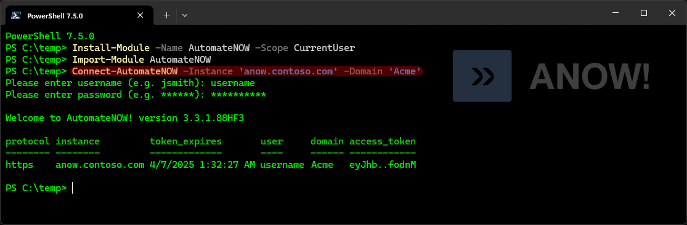
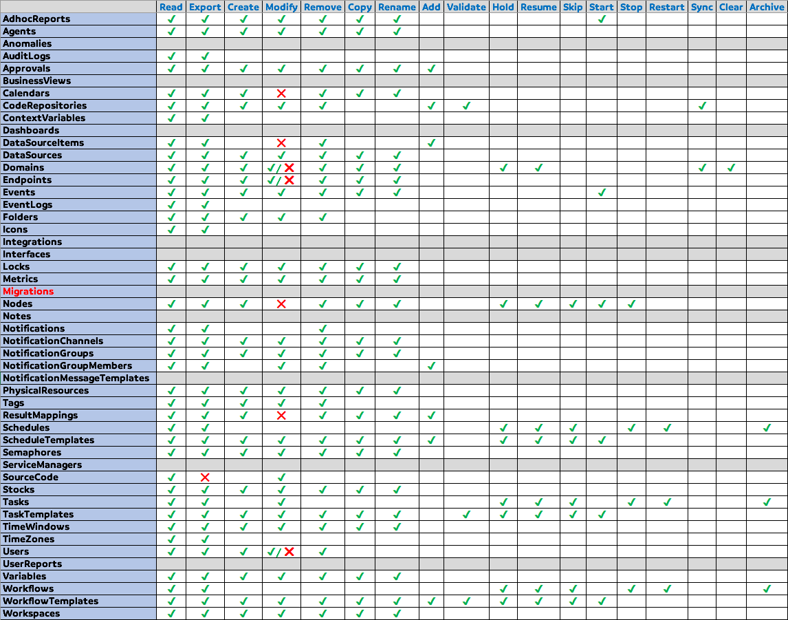

# AutomateNOW! PowerShell module

> Requires an account on an AutomateNOW! instance



```
Created by AutomateNOW-Fan
```
```
⚠ Not affiliated with Beta Systems
```
## Efficacy 🧪

Compatible with AutomateNOW! version 3.3.1.88 HF1
<br/><br/>
## Installation 🏗

Install from the PowerShell Gallery 👉 `Install-Module -Name AutomateNOW -Scope CurrentUser`
<br/><br/>
## Usage 🤔
Use `Connect-AutomateNOW` to establish your session
<br/><br/>
## Features 🤓

- Completely browserless operation
- Both http & https protocols supported
- PowerShell Core & Windows PowerShell compatible
- Classes and enums are defined (see Classes.psm1)
- Pipeline capability to streamline your workloads
- Session tokens will be automatically refreshed during usage
- All functions can return help with Get-Help or the -? parameter
- PSScriptAnalyzer compliant / Approved verbs only
- Alternate encryption key bytes can be supplied (let's hope it is never needed 🤞)
- Integration with the git app for showing out of sync item that require manual merging
- Edit source code objects with NotePad (Windows only for now)
<br/><br/>
## Change Log 📝

## 1.0.34
### Major updates
+ All Get functions support filtering by Tags & Folder 🥳
+ The menu functionality 👉 **Processing List** is now available with `Get-AutomateNOWProcessingList`
+ The menu functionality 👉 **Resource List** is now available with `Get-AutomateNOWResourceList`
+ Processing States are added and fully supported
+ Processing Functions are added and fully supported
+ Bump compatibility to _ANOW version 3.3.1.88 HF1

### Minor updates
+ The new Code Repository domainClass `ItemList` from Patch 87 is recognized by `Read-AutomateNOWCodeRepositoryItem`
+ Rules within an Approval can now be individually removed
+ Rules within a Result Mapping can now be removed
+ Rules within Approvals can now be re-ordered
+ Rules within Result Mappings can now be re-ordered
+ Processing States now include the parent processing template object
+ Tags can now be copied

### Detailed Change Log
- Added new functions: `Clear-AutomateNOWProcessingStateRegistry`, `Copy-AutomateNOWProcessingFunction`, `Copy-AutomateNOWTag`, `Export-AutomateNOWProcessingFunction`, `Export-AutomateNOWProcessingState`, `Get-AutomateNOWProcessingFunction`, `Get-AutomateNOWProcessingList`, `Get-AutomateNOWProcessingState`, `Get-AutomateNOWResourceList`, `New-AutomateNOWProcessingFunction`, `New-AutomateNOWProcessingState`, `Pop-AutomateNOWApprovalRule`, `Pop-AutomateNOWResultMappingRule`, `Push-AutomateNOWApprovalRule`, `Push-AutomateNOWResultMappingRule`, `Read-AutomateNOWProcessingStateItem`, `Register-AutomateNOWProcessingState`, `Remove-AutomateNOWApprovalRule`, `Remove-AutomateNOWProcessingFunction`, `Remove-AutomateNOWProcessingState`, `Remove-AutomateNOWResultMappingRule`, `Rename-AutomateNOWProcessingFunction`, `Reset-AutomateNOWJWTIssuerToken`, `Set-AutomateNOWProcessingFunction`, `Unregister-AutomateNOWProcessingState`
- Fixed an issue with `Read-AutomateNOWCodeRepositoryItem` where Server Node Group items were not recognized
- Fixed an issue with `Set-AutomateNOWRuntimeAction` where Runtime Actions without a rule definition could not be modified
- Fixed an issue with `Get-AutomateNOWResultMapping` where the definition in the returned results could be empty
- Fixed an issue with `Get-AutomateNOWResourceList` where the results would not be returned
- Fixed an ambiguous error message that could occur under `Connect-AutomateNOW` when a non-existent domain was specified
- Added the parameter `-Id` to `Read-AutomateNOWWorkflowTemplateItem`
- Added the parameter `-KeepSessionVariable` to `Disconnect-AutomateNOW`
- Removed the parameter `-All` from `Read-AutomateNOWCodeRepositoryItem` as it is now redundant with Patch 87
- Removed the parameter `-unsetRules` from `Set-AutomateNOWApproval`
- Optimized the parameter sets within `Get-AutomateNOWRuntimeAction`
- Optimized the parameter sets within `Get-AutomateNOWTask`
- Added more information to the "instance_info" object within the ANOW session variable (e.g. _apiReadDefaultMaxDataPageSize_)
- Added a custom class [ANOWReferrer] which formalizes the output of `Find-AutomateNOWObjectReferrer`

## 1.0.33
### Major updates
+ Dashboards are added and fully supported
+ Server Node Groups are added and fully supported
+ Runtime Actions are added and mostly supported (the 'Do Action' tab is missing)

### Minor updates
+ Anomalies can now be added to a Metric (i.e. to create a Resource Anomaly object)
+ All 5 types of Event Logs are fully supported (Agent, Domain, Node, Processing & Resource)
+ You can now pass any type of [ANOWProcessTemplate] object to the pipeline of its respective Get function
+ The last remaining object types (domain classes) have been added to Add/Remove Code Repository Item
+ The last remaining object types (domain classes) have been added to Edit Object Source Code
+ Unlocking user accounts is now supported
+ Bump compatibility to _ANOW version 3.3.1.86 HF3_

### Detailed Change Log
- Added new functions: `Add-AutomateNOWDashboardPortlet`, `Add-AutomateNOWResourceAnomaly`, `Add-AutomateNOWServerNodeGroupItem`, `Copy-AutomateNOWDashboard`, `Copy-AutomateNOWRuntimeAction`, `Copy-AutomateNOWServerNodeGroup`, `Export-AutomateNOWDashboard`, `Export-AutomateNOWRuntimeAction`, `Export-AutomateNOWServerNodeGroup`, `Get-AutomateNOWDashboard`, `Get-AutomateNOWInterface`, `Get-AutomateNOWRuntimeAction`, `Get-AutomateNOWServerNodeGroup`, `New-AutomateNOWDashboard`, `New-AutomateNOWRuntimeAction`, `New-AutomateNOWServerNodeGroup`, `Pop-AutomateNOWDashboard`, `Pop-AutomateNOWServerNodeGroupItem`, `Push-AutomateNOWDashboard`, `Push-AutomateNOWServerNodeGroupItem`, `Read-AutomateNOWDashboardPortlet`, `Read-AutomateNOWServerNodeGroupItem`, `Remove-AutomateNOWDashboard`, `Remove-AutomateNOWDashboardPortlet`, `Remove-AutomateNOWRuntimeAction`, `Remove-AutomateNOWServerNodeGroup`, `Remove-AutomateNOWServerNodeGroupItem`, `Rename-AutomateNOWDashboard`, `Rename-AutomateNOWServerNodeGroup`, `Set-AutomateNOWDashboard`, `Set-AutomateNOWRuntimeAction`, `Set-AutomateNOWServerNodeGroup`, `Unlock-AutomateNOWSecUser`
- Fixed an issue with `Get-AutomateNOWSchedule` by aligning the nullable properties within the [ANOWProcessing] class
- Fixed an issue with the GetCurrentTime() method in the [ANOWTimeZone] class. All calculations have been tested
- Fixed an issue with `Trace-AutomateNOWProcessing` that occurred if the Design Template's taskType was null
- Fixed an issue with `Get-AutomateNOWSecUser` that occurred if the accountValidUntil was null
- Fixed an issue with `Get-AutomateNOWWorkflow` where the -ProcessingStatus parameter could sometimes be ignored
- Added the parameter `-OverrideConnectionRequirement` to `Import-AutomateNOWLocalTimeZone`
- Renamed `Get-AutomateNOWProcessingEventLog` to `Read-AutomateNOWProcessingEventLog` and fixed some minor issues
- Renamed `Get-AutomateNOWTimeTrigger` to `Read-AutomateNOWTimeTrigger`
- Added the remaining object types to `Add-AutomateNOWCodeRepositoryItem`, `Get-AutomateNOWCodeRepositoryObjectSource` and `Remove-AutomateNOWCodeRepositoryItem`
- Added pipeline capability to `Protect-AutomateNOWEncryptedString` (unsecure strings only) and `Unprotect-AutomateNOWEncryptedString`
- Updated the Trace function for patch 86 where TRIGGER tasks no longer have a Task Type defined
- Optimized the Wait functions

## 1.0.32
### Major updates
+ A single command `Trace-AutomateNOWProcessing` will trace any Task, Workflow, Service Manager or Schedule (and optionally return back its Context Variables)
+ Security Roles, User Roles & Domain Roles are added and fully supported.
+ Security Access Tokens for API users are fully supported

### Minor updates
+ You can now easily convert returned context variables into a hash table (or json string) via `ConvertFrom-AutomateNOWContextVariable`
+ Tracing with the `-WaitForExecution` parameter now includes the 'WAITING' status along with 'EXECUTING'
+ You can now change the order of ServerNode Endpoint objects within a Node object
+ Bump compatibility to _ANOW version 3.3.1.85 HF1_

### Detailed Change Log
- Added new functions: `Add-AutomateNOWSecurityAccessToken`, `Add-AutomateNOWSecurityRoleDomain`, `Add-AutomateNOWSecurityRoleUser`, `ConvertFrom-AutomateNOWContextVariable`, `Copy-AutomateNOWAnomaly`, `Copy-AutomateNOWSecurityRole`, `Copy-AutomateNOWSecurityRoleDomain`, `Export-AutomateNOWAnomaly`, `Export-AutomateNOWResourceAnomaly`, `Export-AutomateNOWSecurityAccessToken`, `Export-AutomateNOWSecurityRole`, `Export-AutomateNOWSecurityRoleDomain`, `Export-AutomateNOWSecurityRoleUser`, `Export-AutomateNOWServerNodeEndpoint`, `Get-AutomateNOWAnomaly`, `Get-AutomateNOWSecurityRole`, `New-AutomateNOWAnomaly`, `New-AutomateNOWSecurityRole`, `Pop-AutomateNOWServerNodeEndpoint`, `Push-AutomateNOWServerNodeEndpoint`, `Read-AutomateNOWResourceAnomaly`, `Read-AutomateNOWSecurityAccessToken`, `Read-AutomateNOWSecurityRoleDomain`, `Read-AutomateNOWSecurityRoleUser`, `Remove-AutomateNOWAnomaly`, `Remove-AutomateNOWResourceAnomaly`, `Remove-AutomateNOWSecurityAccessToken`, `Remove-AutomateNOWSecurityRole`, `Remove-AutomateNOWSecurityRoleDomain`, `Remove-AutomateNOWSecurityRoleUser`, `Rename-AutomateNOWAnomaly`, `Rename-AutomateNOWSecurityRole`, `Set-AutomateNOWAnomaly`, `Set-AutomateNOWSecurityRole`, `Set-AutomateNOWSecurityRoleDomain`, `Set-AutomateNOWServerNodeEndpoint`, `Trace-AutomateNOWProcessing`, `Wait-AutomateNOWSchedule`
- Fixed another issue with `Get-AutomateNOWVariable` only returning preview values
- Fixed an issue with the parameter sets for `Set-AutomateNOWBusinessView`
- Corrected the usage of the `iconSet` enum in a number of places (some objects only accept two types of icons instead of three)
- Repaired some issues with `Read-AutomateNOWServiceManagerTemplateItem`
- Renamed all "User" functions to "SecUser" (e.g. `Export-AutomateNOWUser` is now `Export-AutomateNOWSecUser`)
- Renamed `Get-AutomateNOWCodeRepositoryItem` to `Read-AutomateNOWCodeRepositoryItem`
- Renamed the parameter `-InactiveUsers` to `-ActiveUsersOnly` for `Get-AutomateNOWSecUser`
- Renamed `Trace-AutomateNOWWorkflow` to `Trace-AutomateNOWProcessing` (aliases cover Schedules, Service Managers, Tasks & Workflows)
- Changed the default value of `-sortBy` from `id` to `dateCreated` within `Get-AutomateNOWSchedule`, `Get-AutomateNOWServiceManager`, `Get-AutomateNOWTask` & `Get-AutomateNOWWorkflow`
- Added the parameters `-IncludeAPIUsers` and `-APIUsersOnly` to `Get-AutomateNOWSecUser`
- Added the parameters `-startRow` and `-endRow` to `Get-AutomateNOWDomain`
- Added the parameters `-startRow` and `-endRow` to `Get-AutomateNOWFolder`
- Added the parameters `-startRow`, `-endRow` and `-AllDomains` to `Get-AutomateNOWTag`
- Added the parameter `-PreviewOnly` to `Get-AutomateNOWContextVariable`
- Added the parameter `-EventParameters` to `Start-AutomateNOWEvent`
- Added the parameter `-Folder` to `Get-AutomateNOWScheduleTemplate`, `Get-AutomateNOWServiceManagerTemplate` and `Get-AutomateWorkflowScheduleTemplate`
- Added new method `GetCurrentTime()` to [ANOWTimeZone]
- Optimzed and re-organized the **Classes.psm1** file significantly. All custom classes are clearly identified.
- Many tiny fixes and improvements to the in-line help

## 1.0.31
### Major update
+ You can now trace 🕵️‍♂️ Tasks, Workflows and ServiceManagers with `Trace-AutomateNOWWorkflow`
+ You can now include archived items 📦 with the Tasks, Workflows and Service Managers by including `-IncludeArchivedItems`
+ You can now wait ⌚ for a Task, Workflow or Service Manager by way of `Wait-AutomateNOWWorkflow`
+ You can chain together `Start-AutomateNOWWorkflow` with `Trace-AutomateNOWWorkflow` to wait for the context variables 🤯

### Minor updates
+ The CodeRepositoryOutOfSync functions have been renamed to CodeRepositoryConflict
+ Context Variables will now return the **full** value instead of the truncated "preview value"
+ Statistical duration ⌛ can now be configured (by milliseconds) for Task Templates, Schedule Templates, Service Manager Templates and Workflow Templates 🥳
+ Compatibility remains at _ANOW version 3.3.1.84_

### Detailed Change Log
- Added new functions: `Add-AutomateNOWServerNodeEndpoint`, `Add-AutomateNOWServiceManagerTemplateItem`, `Confirm-AutomateNOWServiceManagerTemplate`, `Copy-AutomateNOWServiceManagerTemplate`, `Copy-AutomateNOWUserReport`, `Edit-AutomateNOWDataSourceItem`, `Export-AutomateNOWServiceManager`, `Export-AutomateNOWServiceManagerTemplate`, `Export-AutomateNOWUserReport`, `Get-AutomateNOWServiceManager`, `Get-AutomateNOWServiceManagerTemplate`, `Get-AutomateNOWUserReport`, `New-AutomateNOWServiceManagerTemplate`, `Read-AutomateNOWServerNodeEndpoint`, `Read-AutomateNOWServiceManagerTemplateItem`, `Remove-AutomateNOWServerNodeEndpoint`, `Remove-AutomateNOWServiceManager`, `Remove-AutomateNOWServiceManagerTemplate`, `Remove-AutomateNOWServiceManagerTemplateItem`, `Remove-AutomateNOWUserReport`, `Rename-AutomateNOWServiceManagerTemplate`, `Rename-AutomateNOWUserReport`, `Resolve-AutomateNOWCodeRepository`, `Restart-AutomateNOWServiceManager`, `Resume-AutomateNOWServiceManager`, `Resume-AutomateNOWServiceManagerTemplate`, `Set-AutomateNOWServiceManagerTemplate`, `Set-AutomateNOWUserReport`, `Skip-AutomateNOWServiceManager`, `Skip-AutomateNOWServiceManagerTemplate`, `Start-AutomateNOWServiceManagerTemplate`, `Stop-AutomateNOWServiceManager`, `Suspend-AutomateNOWServiceManager`, `Suspend-AutomateNOWServiceManagerTemplate`, `Trace-AutomateNOWWorkFlow`, `Wait-AutomateNOWServiceManager`, `Wait-AutomateNOWTask`, `Wait-AutomateNOWWorkFlow`
- Renamed `Compare-AutomateNOWCodeRepositoryOutOfSyncItem` to `Compare-AutomateNOWCodeRepositoryConflictItem`
- Renamed `Get-AutomateNOWCodeRepositoryOutOfSyncItem` to `Get-AutomateNOWCodeRepositoryConflictItem`
- Renamed `Get-AutomateNOWDataSourceItem` to `Read-AutomateNOWDataSourceItem`
- Renamed `Merge-AutomateNOWCodeRepositoryOutOfSyncItem` to `Merge-AutomateNOWCodeRepositoryConflictItem`
- Renamed `Show-AutomateNOWCodeRepositoryOutOfSyncItemComparison` to `Show-AutomateNOWCodeRepositoryConflictItemComparison`
- Removed the `-Quiet` parameter from `Stop-AutomateNOWSchedule`, `Stop-AutomateNOWTask`, and `Stop-AutomateNOWWorkflow`
- Moved the 3 helper functions `Compare-ObjectProperty`, `ConvertTo-QueryString` and `New-WebkitBoundaryString` from public to private
- Added the parameters `-DelayedStartTime`, `-TimeZone` and `-VerboseMode` to `Start-AutomateNOWScheduleTemplate`, `Start-AutomateNOWServiceManagerTemplate`, `Start-AutomateNOWTaskTemplate`, `Start-AutomateNOWWorkflowTemplate`, `Set-AutomateNOWServiceManagerTemplate`, `Set-AutomateNOWTaskTemplate` and `Set-AutomateNOWWorkflowTemplate`
- Added the parameters `-DataType`, `-IsArray`, `-ErrorHandling` and `-Validity` to `Set-AutomateNOWDataSource`
- Added the parameter `-launchedById` to `Get-AutomateNOWWorkflow`
- Added the parameters `-IncludeArchived` and `-OnlyArchived` to `Get-AutomateNOWSchedule`, `Get-AutomateNOWTask` and `Get-AutomateNOWWorkflow`
- Added the parameter `-Id` to `Get-AutomateNOWContextVariable`
- Enforced case-sensitivity to all parameters that validate a set (mostly applies to `-sortBy`)
- Fixed an issue with `Connect-AutomateNOW` when using the `-SkipPreviousSessionCheck` parameter
- Fixed an issue with `Disconnect-AutomateNOW` (This function finally behaves the way it was intended to)
- Fixed an issue with the `-UseAutomaticName` parameter on `Start-AutomateNOWWorkflowTemplate`
- Cleaned up and updated the parameters for `New-AutomateNOWTaskTemplate`
- Clarified the error message that `Invoke-AutomateNOWAPI` will display when the ANOW API returns error for unexpected reason (e.g. unstable ANOW instance)

## 1.0.30
- Bump compatibility to _ANOW version 3.3.1.84_
- Added new functions: `Add-AutomateNOWBusinessViewItem`, `Copy-AutomateNOWBusinessView`, `Export-AutomateNOWBusinessView`, `Export-AutomateNOWSecurityEventLog`, `Get-AutomateNOWBusinessView`, `Get-AutomateNOWSecurityEventLog`, `New-AutomateNOWBusinessView`, `Read-AutomateNOWBusinessViewItem`, `Remove-AutomateNOWBusinessView`, `Remove-AutomateNOWBusinessViewItem`, `Rename-AutomateNOWBusinessView`, `Resolve-AutomateNOWEndpoinType2JavaScriptDefinition`, `Set-AutomateNOWBusinessView`
- Added preliminary functionality for securely setting endpoint credentials via `Set-AutomateNOWEndpoint` 🥳
- Renamed the `AutomateNOWNode` functions to `AutomateNOWServerNode`
- Renamed the `-Pass` parameter to `-String` in `Protect-AutomateNOWString`
- Added the `-SecureString` parameter to `Protect-AutomateNOWString`
- Added the `-ForceCommit` parameter to `Publish-AutomateNOWCodeRepository`
- Added the domain class 'DataSource' to `Get-AutomateNOWCodeRepositoryObjectSource` (this means it is now possible to edit the source code of a DataSource 👍)
- Fixed an issue with `Connect-AutomateNOW` where the default domain (if configured for that user) was still used in the connection even if a different domain had been specified via the `-Domain` parameter (workaround: use `Switch-AutomateNOWDomain` after logging in)
- Fixed an issue with `Connect-AutomateNOW` and non-API users whose 'accountValidUntil' date is not configured
- Fixed an issue with `Connect-AutomateNOW` when using `-access_token` without including the `-refresh_token`
- Fixed the error message on all `New-*` functions when receiving a non-zero response from the API
- Fixed an issue with the response object from `Add-AutomateNOWDataSourceItem`
- Fixed an issue with `Add-AutomateNOWCodeRepositoryItem` where the datasource property was wrong for some of the object classes

## 1.0.29
- Bump compatibility to _ANOW version 3.3.1.83 HF0_
- Added new function: `Set-AutomateNOWTimeTrigger`
- Added support for default domain to `Connect-AutomateNOWUser`
- Improved the parameters for `Get-AutomateNOWTimeTrigger`
- Fixed the empty name in the `-Force` confirmation prompt for many functions during pipeline processing
- Fixed an issue with `Get-AutomateNOWWorkflow` when receiving Id's from the pipeline
- Fixed the `-WorkflowType` parameter on `New-AutomateNOWWorkflowTemplate`
- Fixed an issue where `Get-AutomateNOWContextVariable` would accept an empty collection of RunId's
- Fixed an issue with `Get-AutomateNOWTimeTrigger` whenever receiving multiple Schedule Templates during pipeline processing
- Fixed the parameters for `Get-AutomateNOWTask` to allow `-startRow` and `-endRow` parameters when filtering by Task Template
- Fixed the parameters for `Get-AutomateNOWSchedule` to allow `-startRow` and `-endRow` parameters when filtering by Schedule Template

## 1.0.28
- Fixed for PowerShell Gallery

## 1.0.27
- Added new functions: `Copy-AutomateNOWNotificationMessageTemplate`, `Export-AutomateNOWNotificationMessageTemplate`, `Export-AutomateNOWSemaphoreTimestamp`, `Export-AutomateNOWVariableTimestamp`, `Get-AutomateNOWNotificationMessageTemplate`, `New-AutomateNOWNotificationMessageTemplate`, `Remove-AutomateNOWNotificationMessageTemplate`, `Rename-AutomateNOWNotificationMessageTemplate`, `Resume-AutomateNOWTimeTrigger`, `Set-AutomateNOWNotificationMessageTemplate`, `Skip-AutomateNOWTimeTrigger`, `Suspend-AutomateNOWTimeTrigger`
- Fixed a major compatibly issue with Windows PowerShell and authentication functions (PowerShell Core was not affected)
- Fixed some issues with `Add-AutomateNOWNotificationGroupMember`
- Fixed an issue with `New-AutomateNOWTaskTemplate`
- Fixed `New-AutomateNOWTag` to no longer require an icon code & library
- Enforced `Set-AutomateNOWPassword` to accept only secure strings for passwords
- Enforced `Test-AutomateNOWPassword` to accept only secure strings for passwords
- Enforced the Skip functions to always confirm that the object doesn't already have skip set
- Updated and fixed some aspects of the Remove functions
- Updated and fixed some issues with `Add-AutomateNOWScheduleTemplateItem`, `Add-AutomateNOWWorkflowTemplateItem`, `Read-AutomateNOWScheduleTemplateItem`, `Read-AutomateNOWWorkflowTemplateItem`
- Renamed the `-template` parameter on `Get-AutomateNOWWorkflow` to `-WorkflowTemplate` to allow filtering by template
- Added the `-TaskTemplate` parameter to `Get-AutomateNOWTask` to allow filtering by template
- Added the `-ScheduleTemplate` parameter to `Get-AutomateNOWSchedule` to allow filtering by template
- Renamed `Set-AutomateNOWPassword` to `Set-AutomateNOWUserPassword`
- Updated `Show-AutomateNOWEndpointType`
- Updated the built-in help for `Connect-AutomateNOW`
- Downgraded `New-AutomateNOWUser` to experimental status

## 1.0.26
- Bump compatibility to _ANOW version 3.3.1.81 HF0_
- Added new functions: `Add-AutomateNOWNotificationGroupMember`, `Copy-AutomateNOWNotificationChannel`, `Copy-AutomateNOWNotificationGroup`, `Export-AutomateNOWNotificationChannel`, `Export-AutomateNOWNotificationGroupMember`, `Export-AutomateNOWNotificationGroup`, `Export-AutomateNOWNotification`, `Get-AutomateNOWNotificationChannel`, `Get-AutomateNOWNotificationGroupMember`, `Get-AutomateNOWNotificationGroup`, `Get-AutomateNOWNotification`, `New-AutomateNOWNotificationChannel`, `New-AutomateNOWNotificationGroup`, `Remove-AutomateNOWNotificationChannel`, `Remove-AutomateNOWNotificationGroupMember`, `Remove-AutomateNOWNotificationGroup`, `Remove-AutomateNOWNotification`, `Remove-AutomateNOWWorkflowTemplateItem`, `Rename-AutomateNOWNotificationChannel`, `Rename-AutomateNOWNotificationGroup`, `Set-AutomateNOWNotificationChannel`, `Set-AutomateNOWNotificationGroupMember`, `Set-AutomateNOWNotificationGroup`
- Removed function: `Set-AutomateNOWTask`
- Restored missing class property _delayedStartTime_ which impacted `Read-AutomateNOWScheduleTemplateItem` and `Read-AutomateNOWWorkflowTemplateItem`
- Fixed pipeline capability with `Read-AutomateNOWScheduleTemplateItem` and `Read-AutomateNOWWorkflowTemplateItem`
- Fixed an issue with `Get-AutomateNOWContextVariable`
- Repaired the `-Folder` and `-Tags` parameters on `Start-AutomateNOWScheduleTemplate`
- Fixed an issue with `Connect-AutomateNOW` that only manifested if `-User` was used without `-Pass`
- Enforced `Connect-AutomateNOW` to accept only secure strings for passwords
- Ensured that all functions stop 🛑 whenever a non-zero status from the ANOW API is received
- Added the `-Force` parameter to `Edit-AutomateNOWCodeRepositoryObjectSource`
- Added the `-VerboseMode` parameter to `Set-AutomateNOWTaskTemplate` and `Set-AutomateNOWWorkflowTemplate`
- Added the `-InactiveUsers` parameter to `Get-AutomateNOWUser` (Experimental 🧪)
- Added the `-TaskTemplateId` parameter to `Start-AutomateNOWTaskTemplate` (allows specifying the Task Template by name instead of object)
- Added the `-ScheduleTemplateId` parameter to `Start-AutomateNOWScheduleTemplate` (allows specifying the Schedule Template by name instead of object)
- Added the `-WorkflowTemplateId` parameter to `Start-AutomateNOWWorkflowTemplate` (allows specifying the Workflow Template by name instead of object)
- Updated Icons.ps1

## 1.0.25
- Added new functions: `Copy-AutomateNOWEvent`, `Copy-AutomateNOWMetric`, `Copy-AutomateNOWPhysicalResource`, `Export-AutomateNOWCodeRepositoryObjectSource`, `Export-AutomateNOWEvent`, `Export-AutomateNOWMetric`, `Export-AutomateNOWPhysicalResource`, `Get-AutomateNOWEvent`, `Get-AutomateNOWMetric`, `Get-AutomateNOWPhysicalResource`, `New-AutomateNOWEvent`, `New-AutomateNOWMetric`, `New-AutomateNOWPhysicalResource`, `Pop-AutomateNOWLoadBalancerNode`, `Push-AutomateNOWLoadBalancerNode`, `Remove-AutomateNOWEvent`, `Remove-AutomateNOWMetric`, `Remove-AutomateNOWPhysicalResource`, `Rename-AutomateNOWEvent`, `Rename-AutomateNOWMetric`, `Rename-AutomateNOWPhysicalResource`, `Set-AutomateNOWEvent`, `Set-AutomateNOWMetric`, `Set-AutomateNOWPhysicalResource`
- Optimized the classes and enums reducing the Classes.psm1 file by 33% 😲
- Fixed a typo in `Set-AutomateNOWTaskTemplate` (occurred when setting the Node)

## 1.0.24
- Added new functions: `Get-AutomateNOWCodeRepositoryObjectSource`, `Edit-AutomateNOWCodeRepositoryObjectSource`, `Update-AutomateNOWCodeRepositoryObjectSource`
- Added the `-template` parameter to `Get-AutomateNOWWorkflow`
- Added the `-folder` parameter to `Get-AutomateNOWTaskTemplate`

## 1.0.23
- Bump compatibility to _ANOW version 3.3.1.80 HF0_
- Added new functions: `Dismount-AutomateNOWNode`, `Export-AutomateNOWContextVariable`, `Export-AutomateNOWProcessingEventLog`, `Get-AutomateNOWContextVariable`, `Get-AutomateNOWProcessingEventLog`, `Rename-AutomateNOWAdhocReport`, `Rename-AutomateNOWAgent`, `Rename-AutomateNOWApproval`, `Rename-AutomateNOWDataSource`, `Rename-AutomateNOWNode`, `Resume-AutomateNOWNode`, `Skip-AutomateNOWNode`, `Suspend-AutomateNOWNode`
- Added the `-defaultDomain` parameter to `Set-AutomateNOWUser`
- Added support for "Sensor", "Monitor" and "Service Manager" Task types in `New-AutomateNOWTaskTemplate`
- Fixed an issue with `Stop-AutomateNOWNode` and promoted it to high impact and added the `-Force` parameter
- Fixed a fatal typo within `New-AutomateNOWNode`
- Fixed multiple issues in `Get-AutomateNOWWorkflow`
- Improved the warning from `Connect-AutomateNOW` when the existing session has expired
- Removed experimental status from `Write-AutomateNOWIconData`
- Removed references to WorkSpaces in all functions except for `New-AutomateNOWTaskTemplate` and `New-AutomateNOWWorkflowTemplate`

## 1.0.22
- Bump compatibility to _ANOW version 3.3.1.79 HF2_
- Added new functions: `Clear-AutomateNOWDomain`, `Copy-AutomateNOWDomain`, `Copy-AutomateNOWWorkspace`, `New-AutomateNOWDomain`, `Remove-AutomateNOWDomain`, `Rename-AutomateNOWCalendar`, `Rename-AutomateNOWDomain`, `Rename-AutomateNOWEndpoint`, `Rename-AutomateNOWResultMapping`, `Rename-AutomateNOWSemaphore`, `Rename-AutomateNOWWorkspace`, `Resolve-AutomateNOWMonitorType2ServerNodeType`, `Resolve-AutomateNOWSensorType2ServerNodeType`, `Resume-AutomateNOWDomain`, `Set-AutomateNOWDomain`, `Suspend-AutomateNOWDomain`, `Sync-AutomateNOWDomainResource`, `Sync-AutomateNOWDomainServerNode`
- Removed functions: `Add-AutomateNOWProcessingTimeTrigger`, `Copy-AutomateNOWUser`
- Fixed a parameter issue with `Start-AutomateNOWWorkflowTemplate` around the naming of the executed Workflow
- Added automatic recognition for API users (see APIUser in the $anow_session variable)
- Added support for 10 digit expiration dates to `Connect-AutomateNOW`
- Added High Impact status and the `-Force` parameter to all Copy-* and Add-* functions.
- Added the `-Quiet` parameter to all Copy-AutomateNOW* functions.
- Improved how `Invoke-AutomateNOWAPI` handles binary payloads.
- Renamed the ProcessingTimeTrigger functions to TimeTrigger
- Added small improvements to `Get-AutomateNOWTimeTrigger`

## 1.0.21
- Added new functions: `Add-AutomateNOWCodeRepositoryItem`,  `Approve-AutomateNOWCodeRepositoryMergeRequest`,  `Compare-AutomateNOWCodeRepositoryOutOfSyncItem`,  `Confirm-AutomateNOWCodeRepository`,  `Deny-AutomateNOWCodeRepositoryMergeRequest`,  `Get-AutomateNOWCodeRepositoryBranch`,  `Get-AutomateNOWCodeRepositoryItem`,  `Get-AutomateNOWCodeRepositoryMergeRequest`,  `Get-AutomateNOWCodeRepositoryOutOfSyncItem`,  `Get-AutomateNOWCodeRepositoryTag`,  `Merge-AutomateNOWCodeRepositoryBranch`,  `Merge-AutomateNOWCodeRepositoryOutOfSyncItem`,  `New-AutomateNOWCodeRepository`,  `New-AutomateNOWCodeRepositoryBranch`,  `New-AutomateNOWCodeRepositoryTag`,  `Publish-AutomateNOWCodeRepository`,  `Receive-AutomateNOWCodeRepository`,  `Remove-AutomateNOWCodeRepository`,  `Remove-AutomateNOWCodeRepositoryBranch`,  `Remove-AutomateNOWCodeRepositoryItem`,  `Remove-AutomateNOWCodeRepositoryTag`,  `Remove-AutomateNOWScheduleTemplateItem`,  `Select-AutomateNOWCodeRepositoryBranch`,  `Select-AutomateNOWCodeRepositoryTag`,  `Send-AutomateNOWCodeRepository`,  `Set-AutomateNOWCodeRepository`,  `Set-AutomateNOWTask`,  `Show-AutomateNOWCodeRepositoryOutOfSyncItemComparison`,  `Sync-AutomateNOWCodeRepository`,  `UnPublish-AutomateNOWCodeRepository`
- Added complete functionality with Git Repositories. `Show-AutomateNOWCodeRepositoryOutOfSyncItemComparison` requires the git executable to be available.
- Added `-processingCommand` parameter to `Set-AutomateNOWTaskTemplate` allowing changes to the script within the Task Template (experimental)
- Fixed an issue with case-sensitivity when adding Tags to an object
- Improved `Set-AutomateNOWTaskTemplate` by making the boolean parameters nullable

## 1.0.20
- Added new functions: `Add-AutomateNOWScheduleTemplateItem`, `Confirm-AutomateNOWScheduleTemplate`, `Copy-AutomateNOWTimeWindow`, `Export-AutomateNOWTimeWindow`, `Get-AutomateNOWTimeWindow`, `New-AutomateNOWTimeWindow`, `Read-AutomateNOWScheduleTemplateItem`, `Remove-AutomateNOWTimeWindow`, `Rename-AutomateNOWTimeWindow`, `Set-AutomateNOWTimeWindow`
- Fixed a (rare) issue with `Invoke-AutomateNOWAPI` and JSON deserialization (note that MaxJsonLength is set to 2,147,483,647 instead of the default 2,097,152)
- Added parameter `-serverNodeType` along with other minor improvements to `Get-AutomateNOWNode`
- Added parameter `-Quiet` to `Set-AutomateNOWTaskTemplate` and `Set-AutomateNOWWorkflowTemplate`
- Added parameter `-Parameters` to `Start-AutomateNOWTaskTemplate`, `Start-AutomateNOWWorkflowTemplate`, `Start-AutomateNOWScheduleTemplate`. This makes it finally possible to execute Processing Templates with parameters!
- Extended support for adding Processing Template Items to Workflow Templates & Schedule Templates
- Added the ability to modify the tags, folder and code repository to `Set-AutomateNOWDataSource`

## 1.0.19
- Added new functions: `Add-AutomateNOWWorkflowTemplateItem` `Copy-AutomateNOWLock` `Copy-AutomateNOWStock` `Copy-AutomateNOWVariable` `Export-AutomateNOWLock` `Export-AutomateNOWStock` `Export-AutomateNOWVariable` `Get-AutomateNOWLock` `Get-AutomateNOWStock` `Get-AutomateNOWVariable` `Get-AutomateNOWVariableTimestamp` `New-AutomateNOWLock` `New-AutomateNOWStock` `New-AutomateNOWVariable` `Read-AutomateNOWWorkflowTemplateItem` `Remove-AutomateNOWLock` `Remove-AutomateNOWStock` `Remove-AutomateNOWVariable` `Rename-AutomateNOWLock` `Rename-AutomateNOWStock`, `Rename-AutomateNOWVariable`, `Set-AutomateNOWLock`, `Set-AutomateNOWStock`, `Set-AutomateNOWVariable`, `Set-AutomateNOWVariableTimestamp`
- Fixed an issue with `Get-AutomateNOWTask` when using the `-Id` parameter
- Added a new parameter `-ChildNodes` to `Get-AutomateNOWNode`, some other parameters were renamed as well
- Added preliminary support for adding Task Templates to Workflow Templates by way of `Add-AutomateNOWWorkflowTemplateItem`
- Enhanced the password validity checking of `Set-AutomateNOWPassword` by way of `Test-AutomateNOWPassword`
- Enhanced the output of `Invoke-AutomateNOWAPI` when JSON conversion errors occur (workaround: use `-JustGiveMeJSON`)

## 1.0.18
- Added new functions: `Copy-AutomateNOWNode`, `Copy-AutomateNOWResultMapping`, `Copy-AutomateNOWUser`, `Get-AutomateNOWSemaphoreTimestamp`, `New-AutomateNOWServerDayTimestamp`, `New-AutomateNOWUser`, `Remove-AutomateNOWUser`, `Set-AutomateNOWSemaphoreTimestamp`, `Test-AutomateNOWUserPassword`

## 1.0.17
- Bump compatibility to _ANOW version 3.3.1.78 HF2_
- Added new functions: `Add-AutomateNOWProcessingTimeTrigger`, `Copy-AutomateNOWAdhocReport`, `Copy-AutomateNOWAgent`, `Copy-AutomateNOWCalendar`, `Copy-AutomateNOWScheduleTemplate`, `Copy-AutomateNOWSemaphore`, `Export-AutomateNOWAdhocReport`, `Export-AutomateNOWAgent`, `Export-AutomateNOWProcessingTimeTrigger`, `Export-AutomateNOWSchedule`, `Export-AutomateNOWScheduleTemplate`, `Export-AutomateNOWSemaphore`, `Get-AutomateNOWAdhocReport`, `Get-AutomateNOWAgent`, `Get-AutomateNOWProcessingTimeTrigger`, `Get-AutomateNOWSchedule`, `Get-AutomateNOWScheduleTemplate`, `Get-AutomateNOWSemaphore`, `Import-AutomateNOWLocalTimeZone`, `Invoke-AutomateNOWAdhocReport`, `New-AutomateNOWAdhocReport`, `New-AutomateNOWAgent`, `New-AutomateNOWScheduleTemplate`, `New-AutomateNOWSemaphore`, `Remove-AutomateNOWAdhocReport`, `Remove-AutomateNOWAgent`, `Remove-AutomateNOWProcessingTimeTrigger`, `Remove-AutomateNOWSchedule`, `Remove-AutomateNOWScheduleTemplate`, `Remove-AutomateNOWSemaphore`, `Rename-AutomateNOWScheduleTemplate`, `Restart-AutomateNOWSchedule`, `Resume-AutomateNOWSchedule`, `Resume-AutomateNOWScheduleTemplate`, `Set-AutomateNOWAdhocReport`, `Set-AutomateNOWAgent`, `Set-AutomateNOWScheduleTemplate`, `Set-AutomateNOWSemaphore`, `Skip-AutomateNOWSchedule`, `Skip-AutomateNOWScheduleTemplate`, `Start-AutomateNOWScheduleTemplate`, `Stop-AutomateNOWSchedule`, `Suspend-AutomateNOWSchedule`, `Suspend-AutomateNOWScheduleTemplate`
- Added new filtering parameter -processingStatus to `Get-AutomateNOWTask` and `Get-AutomateNOWWorkflow`
- Added new filtering parameter -Tags to `Get-AutomateNOWTaskTemplate`
- Fixed an issue with `Get-AutomateNOWDomain` and domains that have a logo png applied
- Renamed `Protect-AutomateNOWAuthenticationString` to `Protect-AutomateNOWEncryptedString`

## 1.0.16
- Bump compatibility to _ANOW version 3.3.1.76 HF2_
- Added new functions: `Copy-AutomateNOWDataSource`
- Added preliminary support for the new Notes feature
- Added experimental parameter `-All` to `Get-AutomateNOWDataSourceItem`
- Fixed an issue with `Get-AutomateNOWUser` and parsing the domain roles of the root admin account
- Minor improvements to `Disconnect-AutomateNOW`
- Minor improvements to `Connect-AutomateNOW`

## 1.0.15
- Added new functions: `Add-AutomateNOWApprovalRule`, `Copy-AutomateNOWApproval`, `Copy-AutomateNOWEndpoint`, `Export-AutomateNOWApproval`, `Export-AutomateNOWCalendar`, `Export-AutomateNOWEndpoint`, `Get-AutomateNOWApproval`, `Get-AutomateNOWCalendar`, `Get-AutomateNOWEndpoint`, `New-AutomateNOWApproval`, `New-AutomateNOWApprovalRule`, `New-AutomateNOWCalendar`, `New-AutomateNOWEndpoint`, `Remove-AutomateNOWApproval`, `Remove-AutomateNOWCalendar`, `Remove-AutomateNOWEndpoint`, `Set-AutomateNOWApproval`, `Set-AutomateNOWEndpoint`, `Set-AutomateNOWWorkflowTemplate`, `Show-AutomateNOWEndpointType`, `Unprotect-AutomateNOWEncryptedString`
- Fixed an issue for PowerShell 7 that could prevent the classes.psm1 from loading
- Fixed an issue with Daylight Saving Time that impacted `Connect-AutomateNOW`
- Fixed an issue with the `-ReadJSONFromClipboard` parameter of `Connect-AutomateNOW`
- Aligned some parameter names throughout the Set-* functions
- Added -Quiet parameter to all of the New-* functions
- Added 2 new parameters `-LoadBalancersOnly`, `-ChildNodesOnly` to `Get-AutomateNOWNode`
- `Connect-AutomateNOW` now enforces that the domain supplied on the -Domain parameter must actually exist
- `Connect-AutomateNOW` now halts when the -Domain parameter is not supplied but it will display the available domains
- `Get-AutomateNOWTaskTemplate` no longer retrieves a named processing item that is actually a workflow
- `Get-AutomateNOWWorkflowTemplate` no longer retrieves a named processing item that is actually a task
- `Set-AutomateNOWWorkflowTemplate` has support for most of the settings in the Attributes tab. It can also move Workflow Templates into and out of Workspaces.
- `New-AutomateNOWAuthenticationEncryptedString` was renamed to `Protect-AutomateNOWAuthenticationString`

## 1.0.14
- Bump compatibility to _ANOW version 3.3.1.75 HF3_
- Added new functions: `Add-AutomateNOWResultMappingRule` `Export-AutomateNOWResultMapping` `Get-AutomateNOWResultMapping` `New-AutomateNOWResultMapping` `New-AutomateNOWResultMappingRule` `New-AutomateNOWResultMappingRuleCondition` `New-AutomateNOWResultMappingRuleConditionCriteria` `Remove-AutomateNOWResultMapping` `Remove-AutomateNOWTask` `Remove-AutomateNOWWorkflow` `Restart-AutomateNOWTask` `Restart-AutomateNOWWorkflow` `Resume-AutomateNOWTask` `Resume-AutomateNOWWorkflow` `Set-AutomateNOWDataSource` `Set-AutomateNOWTaskTemplate` `Skip-AutomateNOWTask` `Skip-AutomateNOWWorkflow` `Stop-AutomateNOWTask` `Stop-AutomateNOWWorkflow` `Suspend-AutomateNOWTask` `Suspend-AutomateNOWWorkflow`
- Fixed an issue with JSON depth and `Get-AutomateNOWAuditlog`
- `New-AutomateNOWTaskTemplate` will now differentiate between Internal Tasks, Service Manager Tasks and Standard Tasks
- `Set-AutomateNOWWorkspace` has support for all of the settings in the Attributes tab
- `Set-AutomateNOWTaskTemplate` has support for most of the settings in the Attributes tab. It can also move Task Templates into and out of Workspaces.

## 1.0.13
- Fixed an issue with `Connect-AutomateNOW`
- Fixed an issue with `Get-AutomateNOWUser`

## 1.0.12
- Added new functions: `Export-AutomateNOWAuditLog`, `Get-AutomateNOWAuditLog`, `Set-AutomateNOWUser`
- Aligned `Get-AutomateNOWWorkspace` with the other Get-* functions
- Updated and fixed the help examples for many functions
- `Get-AutomateNOWDomain` is now capable of retrieving a single domain
- `Get-AutomateNOWUser` is now capable of retrieving all users (if permissions exist)

## 1.0.11
- Bump compatibility to _ANOW version 3.3.1.75 HF1_
- Added new functions: `Confirm-AutomateNOWTaskTemplate`, `Confirm-AutomateNOWWorkflowTemplate`, `Copy-AutomateNOWTaskTemplate`, `Export-AutomateNOWCodeRepository`, `Get-AutomateNOWCodeRepository`, `Rename-AutomateNOWTaskTemplate`, `Resolve-AutomateNOWTaskType2ServerNodeType`,`Resume-AutomateNOWTaskTemplate`, `Resume-AutomateNOWWorkflowTemplate`, `Skip-AutomateNOWTaskTemplate`, `Skip-AutomateNOWWorkflowTemplate`, `Start-AutomateNOWNode`, `Start-AutomateNOWTaskTemplate`, `Start-AutomateNOWWorkflowTemplate`, `Stop-AutomateNOWNode`, `Suspend-AutomateNOWTaskTemplate`, `Suspend-AutomateNOWWorkflowTemplate`
- Improved the global session variable to use class objects (e.g. [ANOWTimeZone], [ANOWUser])
- Enhanced the `Get-AutomatenowUser` function to fetch the full user details. If you don't know the username (e.g. using an access token) then use the -LoggedOnUser parameter.
- Decorated the [ANOWUser] object with [ANOWDomainRole] and [ANOWSecurityRole] class objects
- Fixed an issue where error messages returned from the API were not always reflected back
- Enforced on most functions that tags, folders, code repositories and workspaces must actually exist before trying to add them to an object
- Lowered the default endRow from 2000 to 100
- Enforced that the endRow must be greater than the startRow
- Fixed an issue with `Get-AutomateNOWTag` when the same tag name occurs across multiple domains
- Enforced that the server node type supplied to `New-AutomateNOWTaskTemplate` must match the task type
- Completed renaming the *Task* functions to *TaskTemplate*. All Task/Workflow functions have been aligned and optimized.

## 1.0.10
- Added new functions: `Add-AutomateNOWDataSourceItem`, `Copy-AutomateNOWWorkflowTemplate`, `Export-AutomateNOWDataSource`, `Export-AutomateNOWDataSourceItem`, `Export-AutomateNOWWorkspace`, `Find-AutomateNOWObjectReferral`, `Get-AutomateNOWDataSource`, `Get-AutomateNOWDataSourceItem`, `Get-AutomateNOWWorkspace`, `New-AutomateNOWDataSource`, `New-AutomateNOWWorkspace`, `Remove-AutomateNOWDataSource`, `Remove-AutomateNOWDataSourceItem`, `Remove-AutomateNOWWorkspace`, `Resume-AutomateNOWTask`, `Set-AutomateNOWFolder`, `Set-AutomateNOWTag`, `Set-AutomateNOWWorkspace`, `Show-AutomateNOWTaskType`
- Organized the classes into "base" and "sub" classes in line with best practices (changes to classes and enums will no longer be listed in this change log)
- Added method CreateOldValues() to ANOW base class. It is imperative that this method will always precisely match what the console expects. This method is intended for use with the Set-* functions.
- Removed a check that is no longer needed from the Remove-* functions
- Fixed an issue with the default constructor on some classes
- Renamed the *Task* and *Workflow* functions to *TaskTemplate* and *WorkflowTemplate* since that's what they actually were
- Added automation mime type detection (ASCII vs. UTF-8) when uploading text files to a Data Source (the console does not do this)

### 1.0.9
- Added new functions: `Export-AutomateNOWDomain`, `Export-AutomateNOWIcon`, `Export-AutomateNOWNode`, `Export-AutomateNOWTag`, `Export-AutomateNOWTask`, `Export-AutomateNOWTimeZone`, `Export-AutomateNOWUser`, `Export-AutomateNOWWorkflow`, `Get-AutomateNOWTimeZone`, `Import-AutomateNOWLocalIcon`, `Import-AutomateNOWTimeZone`, `New-AutomateNOWNode`, `Read-AutomateNOWIcon`, `Remove-AutomateNOWNode`, `Write-AutomateNOWIconData`
- Removed all instances of the -All parameter from the Get-* functions. Instead, the Get-* functions will now return all items by default when no parameters are supplied.
- Consolidated the two session variables into one
- Added pipeline capability to (virtually) all functions 🥳
- Replaced validation arrays with Enums
- Added a welcome 'MOTD' to the default output of `Connect-AutomateNOW`
- Added _-SkipMOTD_ parameter for skipping the 'MOTD' to `Connect-AutomateNOW`
- Added base classes _[ANOWDomain]_, _[ANOWFolder]_, _[ANOWNode]_, _[ANOWTag]_, _[ANOWTask]_, _[ANOWUser]_, _[ANOWWorkflow]_
- Added enums for Icons, Tasks, Users and Workflows
- Removed functions (most of these will be added back after fine-tuning): `Get-AutomateNOWAdhocReport`, `Get-AutomateNOWAuditLog`, `Get-AutomateNOWCalendar`, `Get-AutomateNOWOverview`, `Get-AutomateNOWTriggerLog`, `Read-AutomateNOWTimeZone`, `Show-AutomateNOWDomain`, `Show-AutomateNOWTaskType`, `Start-AutomateNOWTask`
- Removed base class (this will be back after fine-tuning): [_ANOWAuditLogEntry_]

### 1.0.8
- Bump compatibility to _ANOW version 3.3.1.75 HF0_
- Added new functions: `Get-AutomateNOWAdhocReport`, `Get-AutomateNOWAuditLog`, `Get-AutomateNOWCalendar`, `Get-AutomateNOWOverview`, `Read-AutomateNOWTimeZone`
- Replaced hard-coded query strings with properly defined URL parameter hashtables with the help of `ConvertTo-QueryString`
- Fixed an issue with `Import-AutomateNOWIcon` exporting the .csv to the wrong location
- Added support for entering your own session token directly into `Connect-AutomateNOW` (optionally include refresh token + expiration date for best results)
- Added support for reading the authentication JSON payload from the clipboard
- Incorporated `Compare-ObjectProperty` (see PoshFunctions on the PowerShell Gallery)
- Initiated the beginnings of class objects for AutomateNOW objects
- Added base class _[ANOWAuditLogEntry]_ with sub classes (UPDATE, DELETE and INSERT)
- Added base class _[ANOWTimeZone]_
- Added method **CompareOldNewValues()** to derived class _ANOWAuditLogEntry_Update_ (note: only applies to UPDATE audit log entries)
- Added myriad tiny fixes

### 1.0.7
- Added new functions: `Get-AutomateNOWTask`, `Show-AutomateNOWTaskType`, `Start-AutomateNOWTask`
- Added support for transparent colors in `New-AutomateNOWTag`
- Added a requirement to use `Disconnect-AutomateNOW` before connecting to a different instance
- Added the _-Headers_ parameter to `Invoke-AutomateNOWAPI` for including additional headers (experimental)
- Incorporated `ConvertTo-QueryString` (see MSIdentityTools on the PowerShell Gallery)
- Fixed an issue with the token expiration date sometimes showing +1 hour ahead
- Fixed an issue with HTTP error hints not being shown
- Fixed an issue with the domain not being set in the header variable whenever the domain was specified with the _-Domain_ parameter of `Confirm-AutomateNOWSession`

### 1.0.6
- Added new functions: `Get-AutomateNOWWorkflow`, `Get-AutomateNOWFolder`, `New-AutomateNOWFolder`
- Added masked input to (and fixed some minor bugs with) `Connect-AutomateNOW`
- Improved guidance when http codes 401, 403 and 404 are encountered
- Fixed an issue with the usage of `Add-Type` (applies to Windows PowerShell only)
- Changed `Invoke-AutomateNOWAPI` will no longer recognize a GET request that accidentally included a body

### 1.0.5
- Fixed an issue with token updating

### 1.0.4
- Finished adding the help content with examples to each function

### 1.0.3
- Added new functions: `Import-AutomateNOWIcon`, `New-AutomateNOWTag`, `Remove-AutomateNOWTag` & `Update-AutomateNOWToken`
- Added the ability to refresh the token (See `Update-AutomateNOWToken`)
- Fixed an issue where the _-SkipCertificateCheck_ parameter was included in PowerShell 7 even when it was not needed

### 1.0.2
- Cosmetic fixes for PowerShell Gallery (again!)

### 1.0.1
- Cosmetic fixes for PowerShell Gallery

### 1.0.0
- Initial release (feedback requested)
- Compatibile with _ANOW version 3.2.1.69_
<br/><br/>
## Caution 🚸

Use the _-NotSecure_ parameter when connecting to an instance that doesn't use https 😒

## Wish List 🌠

- Enrich the sorting options for all Get functions
- Export diagrams to PNG
- Automatic binary file MIME type detection for `Add-AutomateNOWDataSourceItem`
- Refactor the redundant code
- Export functions should convert objects containing an object type to JSON strings
- Ability to action individual items in a code repository instead of applying the action to all items
- Support for multiple simultaneous sessions to different domains or ANOW servers

## Cheats* 🎰

- Execute Adhoc Reports where you may not have permission to in the UI
- List & apply tags, folders etc. on an instance that you may not have permission to in the UI
- (Psuedo) Rename many object types including Workflow Templates and Task Templates
- Automatic text file MIME type detection for `Add-AutomateNOWDataSourceItem`
- Specify the theme and ui density at the time of user creation
- Modify the source code of certain objects that the UI does not offer (e.g. Stocks)

<sub>* things the console does not allow</sub>

## Questions ❓

### Is this module supported by or affiliated with Beta Systems (formerly InfiniteDATA)
>No. This should be considered a community-supported tool.

### What exactly can I do with this module? How complete is this?
>See the feature chart below



### Where are the connection details stored in my PowerShell session after successfully authenticating?
>Check the global variable `$anow_session`

### Once connected, what's the fastest to get my current access token into my clipboard so I can use it elsewhere?
>`$anow_session.AccessToken | Set-Clipboard`

### Which version of PowerShell do I need?
>This module is compatible with both `Windows PowerShell 5.1` and `PowerShell Core 7.x`

### Do the functions in this module utilize the PowerShell pipeline?
>Yes, except where it doesn't make sense. Otherwise, this module is designed to take advantage of the pipeline.

### I imported the AutomateNOW module into my PowerShell session. What's next?
>Try `Connect-AutomateNOW -?`. Also try `Get-Command -Module AutomateNOW`.

### How can I specify the domain with `Connect-AutomateNOW` if I don't know what the available domains are?
>Use `Connect-AutomateNOW` without the `-Domain` parameter to discover available domains to your account. Then run it again with the -Domain parameter.

### How do I use a particular command? Where's the help?
>Type the name of the command followed by -?.

### Help! I keep receiving the error message "Parameter set cannot be resolved using the specified named parameters."
>Again, type the name of the command followed by -?. You need to review the "parameter sets". Not all parameters can be mixed with others. Please consult the built-in help.

### How do I see the actual payloads, headers, parameters that are sent to ANOW? In other words, how can I see what's happening "under the hood" while the function is running?
>Include the `-Verbose` parameter (use with caution)

### Why don't these functions share the identical verbs as the ANOW UI? (e.g. "Suspend" instead of "Hold")
>As a best practice this module uses only approved verbs that means sometimes the verbs won't match. See https://learn.microsoft.com/en-us/powershell/scripting/developer/cmdlet/approved-verbs-for-windows-powershell-commands for more information.

### Why do I only receive 100 results when using the Get commands? I should be getting more results...
>The default values of `-startRow` and `-endRow` are 0 and 100 respectively. You can use those parameters to paginate the results.

### How do I paginate the results?
>You will have to develop your own routine for cycling through pages. Pay careful attention to the property by which you are sorting! (I'm looking at you `Design Audit Log`)

### Why doesn't this module work correctly with my older version of AutomateNOW?
>This module uses classes and enums to manage the schema. Beta Systems (formerly InfiniteDATA) makes frequent updates to this schema (with most new non-hotfix patch updates). Thus, the incompatilities cannot be helped. You would need to downgrade to an older version of the module.

### How does the password encryption in this module work?
>It's the same as the console. See the `Protect-AutomateNOWEncryptedString` and `Unprotect-AutomateNOWEncryptedString` functions for technical details.

### Why are some of the columns in the export .csv containing `[System.Object]`?
>All of the Export functions are preliminary. Each export function in this module needs to be fine-tuned to ensure each column is property exported. This is on the wish list.

### How do I add a Task Template to a Workflow Template?
>Use `Add-AutomateNOWWorkflowTemplateItem`

### How do I change my domain?
>Use `Switch-AutomateNOWDomain`

### How to retrieve Tasks and Workflows by their RunId?
>Use `Get-AutomateNOWTask` or `Get-AutomateNOWWorkflow` and refer to the Id's that are returned

### How to push my changes to my properly configured code repository that my admin provided?
> Step 1 - Select the branch of the repository
> `Select-AutomateNOWCodeRepositoryBranch` -CodeRepository $repository -Branch 'development' -Force

> Step 2 - Make a change to one of the items in the repository
> `Set-AutomateNOWTaskTemplate` -TaskTemplate $task_template -processingCommand $script -Force

> Step 3 - Commit all of the changes in the repository
> `Publish-AutomateNOWCodeRepository` -CodeRepository $repository -Force

> Step 4 - Push all of the commited changes in the local repository to the remote repository
> `Send-AutomateNOWCodeRepository` -CodeRepository $repository -Force

> Step 5 - Synchronize the local and remote repositories - Do not forget this step! 😅
> `Sync-AutomateNOWCodeRepository` -CodeRepository $repository -Force

### I made a change to the code on my properly configured remote repository. How do I pull it down to the local repository?
> Step 1 - Select the branch of the repository
> `Select-AutomateNOWCodeRepositoryBranch` -CodeRepository $repository -branch 'development' -Force -Quiet

> Step 2 - Pull all of the commited changes in the remote repository to the local repository
> `Receive-AutomateNOWCodeRepository` -CodeRepository $repository -Force

> Step 3 - Synchronize the local and remote repositories - Do not forget this step! 😅
> `Sync-AutomateNOWCodeRepository` -CodeRepository $repository -Force

### Where are the 5 types of Processing Event Logs in the ANOW UI?
>Use `Get-Help Get-AutomateNOWProcessingEventLog -Full` for some hints on where they all are.

### I want to set all values in my Metric to null (i.e. to reset them). How can I do this?
>It's a two-step process. In any order:
>1) Run `Set-AutomateNOWMetric` with the `-UnsetValue` parameter
>2) Run `Set-AutomateNOWMetric` with these parameters: `-UnsetValueUnit` `-UnsetMinValue` `-UnsetVeryLowThreshold` `-UnsetLowThreshold` `-UnsetHighThreshold` `-UnsetVeryHighThreshold` `-UnsetMaxValue`

### Why is there a `-Detailed` parameter for the 9 Resource related Get-* functions? What benefit does it provide?
>- Calendars will include: calculatedDates
>- Events will include: (unknown)
>- Locks will include: lockState
>- Metrics will include: historicalValues
>- Physical Resources will include: historicalValues
>- Semaphores will include: (nothing)
>- Stocks will include: (nothing)
>- Time Windows will include: (nothing)
>- Variables will include: historicalValues

### How do I rearrange the sort orders of the child nodes in my load balancer node?
> Refer to `Push-AutomateNOWLoadBalancerNode` and `Pop-AutomateNOWLoadBalancerNode`

### I'm confused about why some functions are prefixed with New- and others with Add-?
> Refer to Microsoft's guidance on Powershell Approved Verbs. To list both Add and New functions, try this: `Get-Command -Name New-AutomateNOW* | Select-Object -ExpandProperty Name) + (Get-Command -Name Add-AutomateNOW* | Select-Object -ExpandProperty Name) | Sort-Object { $_ -split '-' | Select-Object -Last 1 }`

### Why is there no Copy and Rename functions for Time Triggers?
> The ANOW application does not actually offer this functionality. You must 'add' a Time Trigger to a Schedule Template.

### How can I use `Edit-AutomateNOWDataSourceItem` if I don't already know the 32 character guid Id of the item?
> Use the built-in help `Get-Help Edit-AutomateNOWDataSourceItem -Examples` to see examples

### Why doesn't `Get-AutomateNOWContextVariable` include the level of the variable (i.e. Self, Parent or Root)?
> Use `Trace-AutomateNOWProcessing` with the `-ReturnContextVariables` parameter to have the level of the variables. It is not possible to determine the level of the variable without also knowing the RunId of the Workflows involved.

### I'm tired of seeing the Trigger Items in the results of `Trace-AutomateNOWProcessing`
> Use the `-DoNotIncludeTriggers` parameter

### I need more from `Trace-AutomateNOWProcessing`. It only returns Workflows which were parented by my Workflow. I need to see *everything* which could have been launched by my Workflow.
> Use the `-PerformDeepSearch` parameter

### How do I start a Workflow, wait for it to finish executing and then return all of the related Context Variables in a single command?
> `Get-AutomateNOWWorkflowTemplate -Id 'WorkflowTemplate1' | Start-AutomateNOWWorkflowTemplate | Trace-AutomateNOWProcessing -WaitForExecution -ReturnContextVariables`

### `Trace-AutomateNOWProcessing` doesn't seem to work. It doesn't return all of the processing items that it should be.
> Try adding the `-IncludeArchived` switch parameter to include searching the archived processing items.

### How can I see the items that exist in the UI under the Monitoring -> Trigger tab?
> Use `Get-AutomateNOWSchedule` to retrieve these

### I just want to remove the tags from 1 privilege in a Domain Security Role. How do I do that?
> To clear the tags from an individual privilege in a Domain Security Role without disabling it you have to use the `Set-AutomateNOWSecurityRoleDomain` function twice. First, set the privilege to $false then back to $true.

### What is the difference between an [ANOWResource] object, an [ANOWAnomaly] object and the [ANOWResourceAnomaly] object? This is confusing
> An [ANOWResource] is a base class that is the foundation for the 9 Resource objects (e.g. Locks, Stocks, Metrics).
> An [ANOWAnomaly] is a class representing the ANOW Anomaly object. These are intended for interpreting Metrics.
> An [ANOWResourceAnomaly] is a class representing what you get when you add an Anomaly to a Metric.
> Think of [ANOWResourceAnomaly] as synonymous with adding a Task Template to a Workflow Template or a Business View Item to a Business View.

### Why doesn't `Read-AutomateNOWSecurityAccessToken` include the actual security token?
> `Read-AutomateNOWSecurityAccessToken` will tell you everything else about the security token objects except the actual token. This is by design. You only get to see the token once when it was created with `New-AutomateNOWSecurityAccessToken`.

## Functions 🛠

`Add-AutomateNOWApprovalRule`,

`Add-AutomateNOWBusinessViewItem`,

`Add-AutomateNOWCodeRepositoryItem`,

`Add-AutomateNOWDashboardPortlet`,

`Add-AutomateNOWDataSourceItem`,

`Add-AutomateNOWNotificationGroupMember`,

`Add-AutomateNOWResourceAnomaly`,

`Add-AutomateNOWResultMappingRule`,

`Add-AutomateNOWScheduleTemplateItem`,

`Add-AutomateNOWSecurityAccessToken`,

`Add-AutomateNOWSecurityRoleDomain`,

`Add-AutomateNOWSecurityRoleUser`,

`Add-AutomateNOWServerNodeEndpoint`,

`Add-AutomateNOWServerNodeGroupItem`,

`Add-AutomateNOWServiceManagerTemplateItem`,

`Add-AutomateNOWTimeTrigger`,

`Add-AutomateNOWWorkflowTemplateItem`,

`Approve-AutomateNOWCodeRepositoryMergeRequest`,

`Clear-AutomateNOWDomain`,

`Clear-AutomateNOWProcessingStateRegistry`,

`Compare-AutomateNOWCodeRepositoryConflictItem`,

`Confirm-AutomateNOWCodeRepository`,

`Confirm-AutomateNOWScheduleTemplate`,

`Confirm-AutomateNOWServiceManagerTemplate`,

`Confirm-AutomateNOWSession`,

`Confirm-AutomateNOWTaskTemplate`,

`Confirm-AutomateNOWWorkflowTemplate`,

`Connect-AutomateNOW`,

`ConvertFrom-AutomateNOWContextVariable`,

`Copy-AutomateNOWAdhocReport`,

`Copy-AutomateNOWAgent`,

`Copy-AutomateNOWAnomaly`,

`Copy-AutomateNOWApproval`,

`Copy-AutomateNOWBusinessView`,

`Copy-AutomateNOWCalendar`,

`Copy-AutomateNOWDashboard`,

`Copy-AutomateNOWDataSource`,

`Copy-AutomateNOWDomain`,

`Copy-AutomateNOWEndpoint`,

`Copy-AutomateNOWEvent`,

`Copy-AutomateNOWLock`,

`Copy-AutomateNOWMetric`,

`Copy-AutomateNOWNotificationChannel`,

`Copy-AutomateNOWNotificationGroup`,

`Copy-AutomateNOWNotificationMessageTemplate`,

`Copy-AutomateNOWPhysicalResource`,

`Copy-AutomateNOWProcessingFunction`,

`Copy-AutomateNOWResultMapping`,

`Copy-AutomateNOWRuntimeAction`,

`Copy-AutomateNOWScheduleTemplate`,

`Copy-AutomateNOWSecurityRole`,

`Copy-AutomateNOWSecurityRoleDomain`,

`Copy-AutomateNOWSemaphore`,

`Copy-AutomateNOWServerNode`,

`Copy-AutomateNOWServerNodeGroup`,

`Copy-AutomateNOWServiceManagerTemplate`,

`Copy-AutomateNOWStock`,

`Copy-AutomateNOWTag`,

`Copy-AutomateNOWTaskTemplate`,

`Copy-AutomateNOWTimeWindow`,

`Copy-AutomateNOWUserReport`,

`Copy-AutomateNOWVariable`,

`Copy-AutomateNOWWorkflowTemplate`,

`Copy-AutomateNOWWorkspace`,

`Deny-AutomateNOWCodeRepositoryMergeRequest`,

`Disconnect-AutomateNOW`,

`Dismount-AutomateNOWServerNode`,

`Edit-AutomateNOWCodeRepositoryObjectSource`,

`Edit-AutomateNOWDataSourceItem`,

`Export-AutomateNOWAdhocReport`,

`Export-AutomateNOWAgent`,

`Export-AutomateNOWAnomaly`,

`Export-AutomateNOWApproval`,

`Export-AutomateNOWAuditLog`,

`Export-AutomateNOWBusinessView`,

`Export-AutomateNOWCalendar`,

`Export-AutomateNOWCodeRepository`,

`Export-AutomateNOWCodeRepositoryObjectSource`,

`Export-AutomateNOWContextVariable`,

`Export-AutomateNOWDashboard`,

`Export-AutomateNOWDataSource`,

`Export-AutomateNOWDataSourceItem`,

`Export-AutomateNOWDomain`,

`Export-AutomateNOWEndpoint`,

`Export-AutomateNOWEvent`,

`Export-AutomateNOWFolder`,

`Export-AutomateNOWIcon`,

`Export-AutomateNOWLock`,

`Export-AutomateNOWMetric`,

`Export-AutomateNOWNotification`,

`Export-AutomateNOWNotificationChannel`,

`Export-AutomateNOWNotificationGroup`,

`Export-AutomateNOWNotificationGroupMember`,

`Export-AutomateNOWNotificationMessageTemplate`,

`Export-AutomateNOWPhysicalResource`,

`Export-AutomateNOWProcessingEventLog`,

`Export-AutomateNOWProcessingFunction`,

`Export-AutomateNOWProcessingState`,

`Export-AutomateNOWResourceAnomaly`,

`Export-AutomateNOWResultMapping`,

`Export-AutomateNOWRuntimeAction`,

`Export-AutomateNOWSchedule`,

`Export-AutomateNOWScheduleTemplate`,

`Export-AutomateNOWSecurityAccessToken`,

`Export-AutomateNOWSecurityEventLog`,

`Export-AutomateNOWSecurityRole`,

`Export-AutomateNOWSecurityRoleDomain`,

`Export-AutomateNOWSecurityRoleUser`,

`Export-AutomateNOWSecUser`,

`Export-AutomateNOWSemaphore`,

`Export-AutomateNOWSemaphoreTimestamp`,

`Export-AutomateNOWServerNode`,

`Export-AutomateNOWServerNodeEndpoint`,

`Export-AutomateNOWServerNodeGroup`,

`Export-AutomateNOWServiceManager`,

`Export-AutomateNOWServiceManagerTemplate`,

`Export-AutomateNOWStock`,

`Export-AutomateNOWTag`,

`Export-AutomateNOWTask`,

`Export-AutomateNOWTaskTemplate`,

`Export-AutomateNOWTimeTrigger`,

`Export-AutomateNOWTimeWindow`,

`Export-AutomateNOWTimeZone`,

`Export-AutomateNOWUserReport`,

`Export-AutomateNOWVariable`,

`Export-AutomateNOWVariableTimestamp`,

`Export-AutomateNOWWorkflow`,

`Export-AutomateNOWWorkflowTemplate`,

`Export-AutomateNOWWorkspace`,

`Find-AutomateNOWObjectReferral`,

`Get-AutomateNOWAdhocReport`,

`Get-AutomateNOWAgent`,

`Get-AutomateNOWAnomaly`,

`Get-AutomateNOWApproval`,

`Get-AutomateNOWAuditLog`,

`Get-AutomateNOWBusinessView`,

`Get-AutomateNOWCalendar`,

`Get-AutomateNOWCodeRepository`,

`Get-AutomateNOWCodeRepositoryBranch`,

`Get-AutomateNOWCodeRepositoryConflictItem`,

`Get-AutomateNOWCodeRepositoryMergeRequest`,

`Get-AutomateNOWCodeRepositoryObjectSource`,

`Get-AutomateNOWCodeRepositoryTag`,

`Get-AutomateNOWContextVariable`,

`Get-AutomateNOWDashboard`,

`Get-AutomateNOWDataSource`,

`Get-AutomateNOWDomain`,

`Get-AutomateNOWEndpoint`,

`Get-AutomateNOWEvent`,

`Get-AutomateNOWFolder`,

`Get-AutomateNOWInterface`,

`Get-AutomateNOWLock`,

`Get-AutomateNOWMetric`,

`Get-AutomateNOWNotification`,

`Get-AutomateNOWNotificationChannel`,

`Get-AutomateNOWNotificationGroup`,

`Get-AutomateNOWNotificationGroupMember`,

`Get-AutomateNOWNotificationMessageTemplate`,

`Get-AutomateNOWPhysicalResource`,

`Get-AutomateNOWProcessingFunction`,

`Get-AutomateNOWProcessingList`,

`Get-AutomateNOWProcessingState`,

`Get-AutomateNOWResourceList`,

`Get-AutomateNOWResultMapping`,

`Get-AutomateNOWRuntimeAction`,

`Get-AutomateNOWSchedule`,

`Get-AutomateNOWScheduleTemplate`,

`Get-AutomateNOWSecurityEventLog`,

`Get-AutomateNOWSecurityRole`,

`Get-AutomateNOWSecUser`,

`Get-AutomateNOWSemaphore`,

`Get-AutomateNOWSemaphoreTimestamp`,

`Get-AutomateNOWServerNode`,

`Get-AutomateNOWServerNodeGroup`,

`Get-AutomateNOWServiceManager`,

`Get-AutomateNOWServiceManagerTemplate`,

`Get-AutomateNOWStock`,

`Get-AutomateNOWTag`,

`Get-AutomateNOWTask`,

`Get-AutomateNOWTaskTemplate`,

`Get-AutomateNOWTimeWindow`,

`Get-AutomateNOWTimeZone`,

`Get-AutomateNOWUserReport`,

`Get-AutomateNOWVariable`,

`Get-AutomateNOWVariableTimestamp`,

`Get-AutomateNOWWorkflow`,

`Get-AutomateNOWWorkflowTemplate`,

`Get-AutomateNOWWorkspace`,

`Import-AutomateNOWIcon`,

`Import-AutomateNOWLocalIcon`,

`Import-AutomateNOWLocalTimeZone`,

`Import-AutomateNOWTimeZone`,

`Invoke-AutomateNOWAdhocReport`,

`Invoke-AutomateNOWAPI`,

`Merge-AutomateNOWCodeRepositoryBranch`,

`Merge-AutomateNOWCodeRepositoryConflictItem`,

`New-AutomateNOWAdhocReport`,

`New-AutomateNOWAgent`,

`New-AutomateNOWAnomaly`,

`New-AutomateNOWApproval`,

`New-AutomateNOWApprovalRule`,

`New-AutomateNOWBusinessView`,

`New-AutomateNOWCalendar`,

`New-AutomateNOWCodeRepository`,

`New-AutomateNOWCodeRepositoryBranch`,

`New-AutomateNOWCodeRepositoryTag`,

`New-AutomateNOWDashboard`,

`New-AutomateNOWDataSource`,

`New-AutomateNOWDefaultProcessingTitle`,

`New-AutomateNOWDomain`,

`New-AutomateNOWEndpoint`,

`New-AutomateNOWEvent`,

`New-AutomateNOWFolder`,

`New-AutomateNOWLock`,

`New-AutomateNOWMetric`,

`New-AutomateNOWNotificationChannel`,

`New-AutomateNOWNotificationGroup`,

`New-AutomateNOWNotificationMessageTemplate`,

`New-AutomateNOWPhysicalResource`,

`New-AutomateNOWProcessingFunction`,

`New-AutomateNOWProcessingState`,

`New-AutomateNOWResultMapping`,

`New-AutomateNOWResultMappingRule`,

`New-AutomateNOWResultMappingRuleCondition`,

`New-AutomateNOWResultMappingRuleConditionCriteria`,

`New-AutomateNOWRuntimeAction`,

`New-AutomateNOWScheduleTemplate`,

`New-AutomateNOWSecurityRole`,

`New-AutomateNOWSecUser`,

`New-AutomateNOWSemaphore`,

`New-AutomateNOWServerDayTimestamp`,

`New-AutomateNOWServerNode`,

`New-AutomateNOWServerNodeGroup`,

`New-AutomateNOWServiceManagerTemplate`,

`New-AutomateNOWStock`,

`New-AutomateNOWTag`,

`New-AutomateNOWTaskTemplate`,

`New-AutomateNOWTimeWindow`,

`New-AutomateNOWVariable`,

`New-AutomateNOWWorkflowTemplate`,

`New-AutomateNOWWorkspace`,

`Pop-AutomateNOWApprovalRule`,

`Pop-AutomateNOWDashboard`,

`Pop-AutomateNOWLoadBalancerNode`,

`Pop-AutomateNOWResultMappingRule`,

`Pop-AutomateNOWServerNodeEndpoint`,

`Pop-AutomateNOWServerNodeGroupItem`,

`Protect-AutomateNOWEncryptedString`,

`Publish-AutomateNOWCodeRepository`,

`Push-AutomateNOWApprovalRule`,

`Push-AutomateNOWDashboard`,

`Push-AutomateNOWLoadBalancerNode`,

`Push-AutomateNOWResultMappingRule`,

`Push-AutomateNOWServerNodeEndpoint`,

`Push-AutomateNOWServerNodeGroupItem`,

`Read-AutomateNOWBusinessViewItem`,

`Read-AutomateNOWCodeRepositoryItem`,

`Read-AutomateNOWDashboardPortlet`,

`Read-AutomateNOWDataSourceItem`,

`Read-AutomateNOWIcon`,

`Read-AutomateNOWProcessingEventLog`,

`Read-AutomateNOWProcessingStateItem`,

`Read-AutomateNOWResourceAnomaly`,

`Read-AutomateNOWScheduleTemplateItem`,

`Read-AutomateNOWSecurityAccessToken`,

`Read-AutomateNOWSecurityRoleDomain`,

`Read-AutomateNOWSecurityRoleUser`,

`Read-AutomateNOWServerNodeEndpoint`,

`Read-AutomateNOWServerNodeGroupItem`,

`Read-AutomateNOWServiceManagerTemplateItem`,

`Read-AutomateNOWTimeTrigger`,

`Read-AutomateNOWWorkflowTemplateItem`,

`Receive-AutomateNOWCodeRepository`,

`Register-AutomateNOWProcessingState`,

`Remove-AutomateNOWAdhocReport`,

`Remove-AutomateNOWAgent`,

`Remove-AutomateNOWAnomaly`,

`Remove-AutomateNOWApproval`,

`Remove-AutomateNOWApprovalRule`,

`Remove-AutomateNOWBusinessView`,

`Remove-AutomateNOWBusinessViewItem`,

`Remove-AutomateNOWCalendar`,

`Remove-AutomateNOWCodeRepository`,

`Remove-AutomateNOWCodeRepositoryBranch`,

`Remove-AutomateNOWCodeRepositoryItem`,

`Remove-AutomateNOWCodeRepositoryTag`,

`Remove-AutomateNOWDashboard`,

`Remove-AutomateNOWDashboardPortlet`,

`Remove-AutomateNOWDataSource`,

`Remove-AutomateNOWDataSourceItem`,

`Remove-AutomateNOWDomain`,

`Remove-AutomateNOWEndpoint`,

`Remove-AutomateNOWEvent`,

`Remove-AutomateNOWFolder`,

`Remove-AutomateNOWLock`,

`Remove-AutomateNOWMetric`,

`Remove-AutomateNOWNotification`,

`Remove-AutomateNOWNotificationChannel`,

`Remove-AutomateNOWNotificationGroup`,

`Remove-AutomateNOWNotificationGroupMember`,

`Remove-AutomateNOWNotificationMessageTemplate`,

`Remove-AutomateNOWPhysicalResource`,

`Remove-AutomateNOWProcessingFunction`,

`Remove-AutomateNOWProcessingState`,

`Remove-AutomateNOWResourceAnomaly`,

`Remove-AutomateNOWResultMapping`,

`Remove-AutomateNOWResultMappingRule`,

`Remove-AutomateNOWRuntimeAction`,

`Remove-AutomateNOWSchedule`,

`Remove-AutomateNOWScheduleTemplate`,

`Remove-AutomateNOWScheduleTemplateItem`,

`Remove-AutomateNOWSecurityAccessToken`,

`Remove-AutomateNOWSecurityRole`,

`Remove-AutomateNOWSecurityRoleDomain`,

`Remove-AutomateNOWSecurityRoleUser`,

`Remove-AutomateNOWSecUser`,

`Remove-AutomateNOWSemaphore`,

`Remove-AutomateNOWServerNode`,

`Remove-AutomateNOWServerNodeEndpoint`,

`Remove-AutomateNOWServerNodeGroup`,

`Remove-AutomateNOWServerNodeGroupItem`,

`Remove-AutomateNOWServiceManager`,

`Remove-AutomateNOWServiceManagerTemplate`,

`Remove-AutomateNOWServiceManagerTemplateItem`,

`Remove-AutomateNOWStock`,

`Remove-AutomateNOWTag`,

`Remove-AutomateNOWTask`,

`Remove-AutomateNOWTaskTemplate`,

`Remove-AutomateNOWTimeTrigger`,

`Remove-AutomateNOWTimeWindow`,

`Remove-AutomateNOWUserReport`,

`Remove-AutomateNOWVariable`,

`Remove-AutomateNOWWorkflow`,

`Remove-AutomateNOWWorkflowTemplate`,

`Remove-AutomateNOWWorkflowTemplateItem`,

`Remove-AutomateNOWWorkspace`,

`Rename-AutomateNOWAdhocReport`,

`Rename-AutomateNOWAgent`,

`Rename-AutomateNOWAnomaly`,

`Rename-AutomateNOWApproval`,

`Rename-AutomateNOWBusinessView`,

`Rename-AutomateNOWCalendar`,

`Rename-AutomateNOWDashboard`,

`Rename-AutomateNOWDataSource`,

`Rename-AutomateNOWDomain`,

`Rename-AutomateNOWEndpoint`,

`Rename-AutomateNOWEvent`,

`Rename-AutomateNOWLock`,

`Rename-AutomateNOWMetric`,

`Rename-AutomateNOWNotificationChannel`,

`Rename-AutomateNOWNotificationGroup`,

`Rename-AutomateNOWNotificationMessageTemplate`,

`Rename-AutomateNOWPhysicalResource`,

`Rename-AutomateNOWProcessingFunction`,

`Rename-AutomateNOWResultMapping`,

`Rename-AutomateNOWScheduleTemplate`,

`Rename-AutomateNOWSecurityRole`,

`Rename-AutomateNOWSemaphore`,

`Rename-AutomateNOWServerNode`,

`Rename-AutomateNOWServerNodeGroup`,

`Rename-AutomateNOWServiceManagerTemplate`,

`Rename-AutomateNOWStock`,

`Rename-AutomateNOWTaskTemplate`,

`Rename-AutomateNOWTimeWindow`,

`Rename-AutomateNOWUserReport`,

`Rename-AutomateNOWVariable`,

`Rename-AutomateNOWWorkflowTemplate`,

`Rename-AutomateNOWWorkspace`,

`Reset-AutomateNOWJWTIssuerToken`,

`Resolve-AutomateNOWCodeRepository`,

`Resolve-AutomateNOWMonitorType2ServerNodeType`,

`Resolve-AutomateNOWSensorType2ServerNodeType`,

`Resolve-AutomateNOWTaskType2ServerNodeType`,

`Restart-AutomateNOWSchedule`,

`Restart-AutomateNOWServiceManager`,

`Restart-AutomateNOWTask`,

`Restart-AutomateNOWWorkflow`,

`Resume-AutomateNOWDomain`,

`Resume-AutomateNOWSchedule`,

`Resume-AutomateNOWScheduleTemplate`,

`Resume-AutomateNOWServerNode`,

`Resume-AutomateNOWServiceManager`,

`Resume-AutomateNOWServiceManagerTemplate`,

`Resume-AutomateNOWTask`,

`Resume-AutomateNOWTaskTemplate`,

`Resume-AutomateNOWTimeTrigger`,

`Resume-AutomateNOWWorkflow`,

`Resume-AutomateNOWWorkflowTemplate`,

`Select-AutomateNOWCodeRepositoryBranch`,

`Select-AutomateNOWCodeRepositoryTag`,

`Send-AutomateNOWCodeRepository`,

`Set-AutomateNOWAdhocReport`,

`Set-AutomateNOWAgent`,

`Set-AutomateNOWAnomaly`,

`Set-AutomateNOWApproval`,

`Set-AutomateNOWBusinessView`,

`Set-AutomateNOWCodeRepository`,

`Set-AutomateNOWDashboard`,

`Set-AutomateNOWDataSource`,

`Set-AutomateNOWDomain`,

`Set-AutomateNOWEndpoint`,

`Set-AutomateNOWEvent`,

`Set-AutomateNOWFolder`,

`Set-AutomateNOWLock`,

`Set-AutomateNOWMetric`,

`Set-AutomateNOWNotificationChannel`,

`Set-AutomateNOWNotificationGroup`,

`Set-AutomateNOWNotificationGroupMember`,

`Set-AutomateNOWNotificationMessageTemplate`,

`Set-AutomateNOWPhysicalResource`,

`Set-AutomateNOWProcessingFunction`,

`Set-AutomateNOWRuntimeAction`,

`Set-AutomateNOWScheduleTemplate`,

`Set-AutomateNOWSecurityRole`,

`Set-AutomateNOWSecurityRoleDomain`,

`Set-AutomateNOWSecUser`,

`Set-AutomateNOWSecUserPassword`,

`Set-AutomateNOWSemaphore`,

`Set-AutomateNOWSemaphoreTimestamp`,

`Set-AutomateNOWServerNodeEndpoint`,

`Set-AutomateNOWServerNodeGroup`,

`Set-AutomateNOWServiceManagerTemplate`,

`Set-AutomateNOWStock`,

`Set-AutomateNOWTag`,

`Set-AutomateNOWTaskTemplate`,

`Set-AutomateNOWTimeTrigger`,

`Set-AutomateNOWTimeWindow`,

`Set-AutomateNOWUserReport`,

`Set-AutomateNOWVariable`,

`Set-AutomateNOWVariableTimestamp`,

`Set-AutomateNOWWorkflowTemplate`,

`Set-AutomateNOWWorkspace`,

`Show-AutomateNOWCodeRepositoryConflictItemComparison`,

`Show-AutomateNOWEndpointType`,

`Show-AutomateNOWTaskTemplateType`,

`Skip-AutomateNOWSchedule`,

`Skip-AutomateNOWScheduleTemplate`,

`Skip-AutomateNOWServerNode`,

`Skip-AutomateNOWServiceManager`,

`Skip-AutomateNOWServiceManagerTemplate`,

`Skip-AutomateNOWTask`,

`Skip-AutomateNOWTaskTemplate`,

`Skip-AutomateNOWTimeTrigger`,

`Skip-AutomateNOWWorkflow`,

`Skip-AutomateNOWWorkflowTemplate`,

`Start-AutomateNOWEvent`,

`Start-AutomateNOWScheduleTemplate`,

`Start-AutomateNOWServerNode`,

`Start-AutomateNOWServiceManagerTemplate`,

`Start-AutomateNOWTaskTemplate`,

`Start-AutomateNOWWorkflowTemplate`,

`Stop-AutomateNOWSchedule`,

`Stop-AutomateNOWServerNode`,

`Stop-AutomateNOWServiceManager`,

`Stop-AutomateNOWTask`,

`Stop-AutomateNOWWorkflow`,

`Suspend-AutomateNOWDomain`,

`Suspend-AutomateNOWSchedule`,

`Suspend-AutomateNOWScheduleTemplate`,

`Suspend-AutomateNOWServerNode`,

`Suspend-AutomateNOWServiceManager`,

`Suspend-AutomateNOWServiceManagerTemplate`,

`Suspend-AutomateNOWTask`,

`Suspend-AutomateNOWTaskTemplate`,

`Suspend-AutomateNOWTimeTrigger`,

`Suspend-AutomateNOWWorkflow`,

`Suspend-AutomateNOWWorkflowTemplate`,

`Switch-AutomateNOWDomain`,

`Sync-AutomateNOWCodeRepository`,

`Sync-AutomateNOWDomainResource`,

`Sync-AutomateNOWDomainServerNode`,

`Test-AutomateNOWSecUserPassword`,

`Trace-AutomateNOWProcessing`,

`Unlock-AutomateNOWSecUser`,

`Unprotect-AutomateNOWEncryptedString`,

`UnPublish-AutomateNOWCodeRepository`,

`Unregister-AutomateNOWProcessingState`,

`Update-AutomateNOWCodeRepositoryObjectSource`,

`Update-AutomateNOWToken`,

`Wait-AutomateNOWSchedule`,

`Wait-AutomateNOWServiceManager`,

`Wait-AutomateNOWTask`,

`Wait-AutomateNOWWorkFlow`,

`Write-AutomateNOWIconData`
