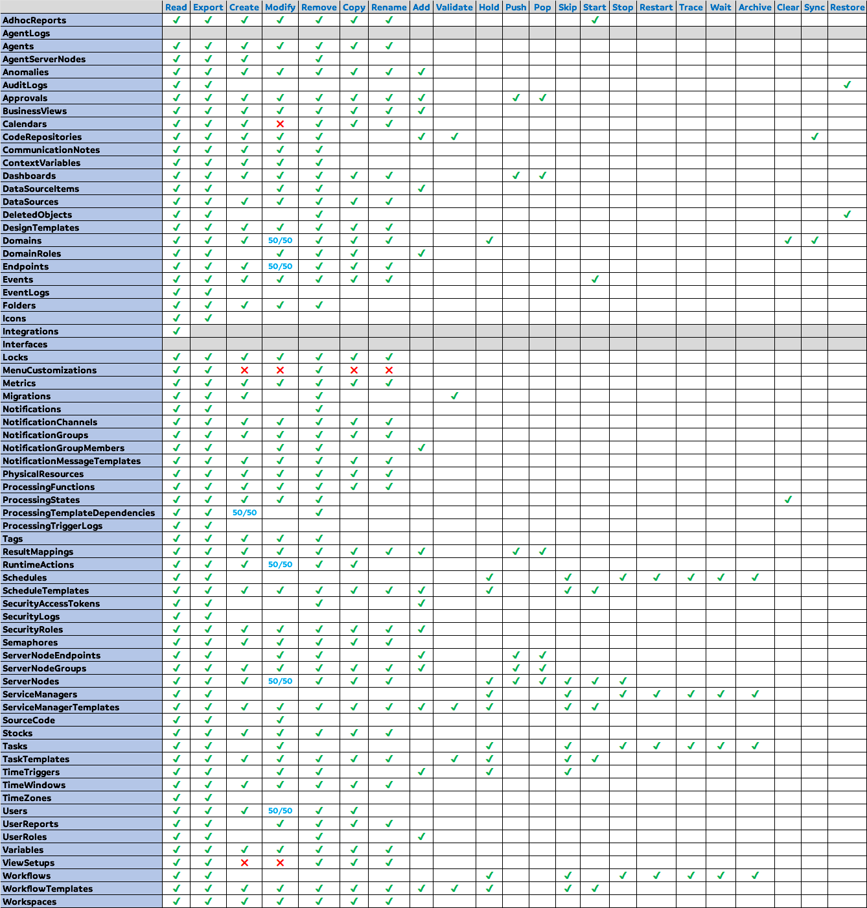

# AutomateNOW! PowerShell module

> Requires an account on an AutomateNOW! instance


```
Created by AutomateNOW-Fan
```
```
⚠ Not affiliated with InfiniteDATA/Beta Systems
```
## Efficacy 🧪

Compatible with AutomateNOW! version 3.3.1.79 HF2
<br/><br/>
## Installation 🏗

Install from the PowerShell Gallery 👉 `Install-Module -Name AutomateNOW -Scope CurrentUser`
<br/><br/>
## Usage 🤔
Use `Connect-AutomateNOW` to establish your session (access token)
<br/><br/>
## Features 🤓

- Completely browserless operation
- Both http & https protocols supported
- PowerShell Core & Windows PowerShell compatible
- Classes and enums are defined (see Classes.psm1)
- Pipeline capability to streamline your workloads
- Session tokens will be automatically refreshed during usage
- All functions can return help with Get-Help or the -? parameter
- PSScriptAnalyzer compliant / Approved verbs only
- Alternate encryption key bytes can be supplied (let's hope it is never needed 🤞)
- Integration with the git app for showing out of sync item that require manual merging
<br/><br/>
## Change Log 📝

## 1.0.22
- Added new functions: `Clear-AutomateNOWDomain`, `Copy-AutomateNOWDomain`, `Copy-AutomateNOWWorkspace`, `New-AutomateNOWDomain`, `Remove-AutomateNOWDomain`, `Rename-AutomateNOWCalendar`, `Rename-AutomateNOWDomain`, `Rename-AutomateNOWEndpoint`, `Rename-AutomateNOWResultMapping`, `Rename-AutomateNOWSemaphore`, `Rename-AutomateNOWWorkspace`, `Resolve-AutomateNOWMonitorType2ServerNodeType`, `Resolve-AutomateNOWSensorType2ServerNodeType`, `Resume-AutomateNOWDomain`, `Set-AutomateNOWDomain`, `Suspend-AutomateNOWDomain`, `Sync-AutomateNOWDomainResource`, `Sync-AutomateNOWDomainServerNode`
- Removed functions: `Add-AutomateNOWProcessingTimeTrigger`, `Copy-AutomateNOWUser`
- Bump compatibility to ANOW version 3.3.1.79 HF2
- Fixed a parameter issue with `Start-AutomateNOWWorkflowTemplate` around the naming of the executed Workflow
- Added automatic recognition for API users (see APIUser in the $anow_session variable)
- Added support for 10 digit expiration dates to `Connect-AutomateNOW`
- Added High Impact status and the `-Force` parameter to all Copy-* and Add-* functions.
- Added the `-Quiet` parameter to all Copy-AutomateNOW* functions.
- Improved how `Invoke-AutomateNOWAPI` handles binary payloads.
- Renamed the ProcessingTimeTrigger functions to TimeTrigger
- Added small improvements to `Get-AutomateNOWTimeTrigger`

## 1.0.21
- Added new functions: `Add-AutomateNOWCodeRepositoryItem`,  `Approve-AutomateNOWCodeRepositoryMergeRequest`,  `Compare-AutomateNOWCodeRepositoryOutOfSyncItem`,  `Confirm-AutomateNOWCodeRepository`,  `Deny-AutomateNOWCodeRepositoryMergeRequest`,  `Get-AutomateNOWCodeRepositoryBranch`,  `Get-AutomateNOWCodeRepositoryItem`,  `Get-AutomateNOWCodeRepositoryMergeRequest`,  `Get-AutomateNOWCodeRepositoryOutOfSyncItem`,  `Get-AutomateNOWCodeRepositoryTag`,  `Merge-AutomateNOWCodeRepositoryBranch`,  `Merge-AutomateNOWCodeRepositoryOutOfSyncItem`,  `New-AutomateNOWCodeRepository`,  `New-AutomateNOWCodeRepositoryBranch`,  `New-AutomateNOWCodeRepositoryTag`,  `Publish-AutomateNOWCodeRepository`,  `Receive-AutomateNOWCodeRepository`,  `Remove-AutomateNOWCodeRepository`,  `Remove-AutomateNOWCodeRepositoryBranch`,  `Remove-AutomateNOWCodeRepositoryItem`,  `Remove-AutomateNOWCodeRepositoryTag`,  `Remove-AutomateNOWScheduleTemplateItem`,  `Select-AutomateNOWCodeRepositoryBranch`,  `Select-AutomateNOWCodeRepositoryTag`,  `Send-AutomateNOWCodeRepository`,  `Set-AutomateNOWCodeRepository`,  `Set-AutomateNOWTask`,  `Show-AutomateNOWCodeRepositoryOutOfSyncItemComparison`,  `Sync-AutomateNOWCodeRepository`,  `UnPublish-AutomateNOWCodeRepository`
- Added complete functionality with Git Repositories. `Show-AutomateNOWCodeRepositoryOutOfSyncItemComparison` requires the git executable to be available.
- Added `-processingCommand` parameter to `Set-AutomateNOWTaskTemplate` allowing changes to the script within the Task Template (experimental)
- Fixed an issue with case-sensitivity when adding Tags to an object
- Improved `Set-AutomateNOWTaskTemplate` by making the boolean parameters nullable

## 1.0.20
- Added new functions: `Add-AutomateNOWScheduleTemplateItem`, `Confirm-AutomateNOWScheduleTemplate`, `Copy-AutomateNOWTimeWindow`, `Export-AutomateNOWTimeWindow`, `Get-AutomateNOWTimeWindow`, `New-AutomateNOWTimeWindow`, `Read-AutomateNOWScheduleTemplateItem`, `Remove-AutomateNOWTimeWindow`, `Rename-AutomateNOWTimeWindow`, `Set-AutomateNOWTimeWindow`
- Fixed a (rare) issue with `Invoke-AutomateNOWAPI` and JSON deserialization (note that MaxJsonLength is set to 2,147,483,647 instead of the default 2,097,152)
- Added parameter `-serverNodeType` along with other minor improvements to `Get-AutomateNOWNode`
- Added parameter `-Quiet` to `Set-AutomateNOWTaskTemplate` and `Set-AutomateNOWWorkflowTemplate`
- Added parameter `-Parameters` to `Start-AutomateNOWTaskTemplate`, `Start-AutomateNOWWorkflowTemplate`, `Start-AutomateNOWScheduleTemplate`. This makes it finally possible to execute Processing Templates with parameters!
- Extended support for adding Processing Template Items to Workflow Templates & Schedule Templates
- Added the ability to modify the tags, folder and code repository to `Set-AutomateNOWDataSource`

## 1.0.19
- Added new functions: `Add-AutomateNOWWorkflowTemplateItem` `Copy-AutomateNOWLock` `Copy-AutomateNOWStock` `Copy-AutomateNOWVariable` `Export-AutomateNOWLock` `Export-AutomateNOWStock` `Export-AutomateNOWVariable` `Get-AutomateNOWLock` `Get-AutomateNOWStock` `Get-AutomateNOWVariable` `Get-AutomateNOWVariableTimestamp` `New-AutomateNOWLock` `New-AutomateNOWStock` `New-AutomateNOWVariable` `Read-AutomateNOWWorkflowTemplateItem` `Remove-AutomateNOWLock` `Remove-AutomateNOWStock` `Remove-AutomateNOWVariable` `Rename-AutomateNOWLock` `Rename-AutomateNOWStock`, `Rename-AutomateNOWVariable`, `Set-AutomateNOWLock`, `Set-AutomateNOWStock`, `Set-AutomateNOWVariable`, `Set-AutomateNOWVariableTimestamp`
- Fixed an issue with `Get-AutomateNOWTask` when using the `-Id` parameter
- Added a new parameter `-ChildNodes` to `Get-AutomateNOWNode`, some other parameters were renamed as well
- Added preliminary support for adding Task Templates to Workflow Templates by way of `Add-AutomateNOWWorkflowTemplateItem`
- Enhanced the password validity checking of `Set-AutomateNOWPassword` by way of `Test-AutomateNOWPassword`
- Enhanced the output of `Invoke-AutomateNOWAPI` when JSON conversion errors occur (workaround: use `-JustGiveMeJSON`)

## 1.0.18
- Added new functions: `Copy-AutomateNOWNode`, `Copy-AutomateNOWResultMapping`, `Copy-AutomateNOWUser`, `Get-AutomateNOWSemaphoreTimestamp`, `New-AutomateNOWServerDayTimestamp`, `New-AutomateNOWUser`, `Remove-AutomateNOWUser`, `Set-AutomateNOWSemaphoreTimestamp`, `Test-AutomateNOWUserPassword`

## 1.0.17
- Added new functions: `Add-AutomateNOWProcessingTimeTrigger`, `Copy-AutomateNOWAdhocReport`, `Copy-AutomateNOWAgent`, `Copy-AutomateNOWCalendar`, `Copy-AutomateNOWScheduleTemplate`, `Copy-AutomateNOWSemaphore`, `Export-AutomateNOWAdhocReport`, `Export-AutomateNOWAgent`, `Export-AutomateNOWProcessingTimeTrigger`, `Export-AutomateNOWSchedule`, `Export-AutomateNOWScheduleTemplate`, `Export-AutomateNOWSemaphore`, `Get-AutomateNOWAdhocReport`, `Get-AutomateNOWAgent`, `Get-AutomateNOWProcessingTimeTrigger`, `Get-AutomateNOWSchedule`, `Get-AutomateNOWScheduleTemplate`, `Get-AutomateNOWSemaphore`, `Import-AutomateNOWLocalTimeZone`, `Invoke-AutomateNOWAdhocReport`, `New-AutomateNOWAdhocReport`, `New-AutomateNOWAgent`, `New-AutomateNOWScheduleTemplate`, `New-AutomateNOWSemaphore`, `Remove-AutomateNOWAdhocReport`, `Remove-AutomateNOWAgent`, `Remove-AutomateNOWProcessingTimeTrigger`, `Remove-AutomateNOWSchedule`, `Remove-AutomateNOWScheduleTemplate`, `Remove-AutomateNOWSemaphore`, `Rename-AutomateNOWScheduleTemplate`, `Restart-AutomateNOWSchedule`, `Resume-AutomateNOWSchedule`, `Resume-AutomateNOWScheduleTemplate`, `Set-AutomateNOWAdhocReport`, `Set-AutomateNOWAgent`, `Set-AutomateNOWScheduleTemplate`, `Set-AutomateNOWSemaphore`, `Skip-AutomateNOWSchedule`, `Skip-AutomateNOWScheduleTemplate`, `Start-AutomateNOWScheduleTemplate`, `Stop-AutomateNOWSchedule`, `Suspend-AutomateNOWSchedule`, `Suspend-AutomateNOWScheduleTemplate`
- Bump compatibility to ANOW version 3.3.1.78 HF2
- Added new filtering parameter -processingStatus to `Get-AutomateNOWTask` and `Get-AutomateNOWWorkflow`
- Added new filtering parameter -Tags to `Get-AutomateNOWTaskTemplate`
- Fixed an issue with `Get-AutomateNOWDomain` and domains that have a logo png applied
- Renamed `Protect-AutomateNOWAuthenticationString` to `Protect-AutomateNOWEncryptedString`

## 1.0.16
- Added new functions: `Copy-AutomateNOWDataSource`
- Bump compatibility to ANOW version 3.3.1.76 HF2
- Added preliminary support for the new Notes feature
- Added experimental parameter `-All` to `Get-AutomateNOWDataSourceItem`
- Fixed an issue with `Get-AutomateNOWUser` and parsing the domain roles of the root admin account
- Minor improvements to `Disconnect-AutomateNOW`
- Minor improvements to `Connect-AutomateNOW`

## 1.0.15
- Added new functions: `Add-AutomateNOWApprovalRule`, `Copy-AutomateNOWApproval`, `Copy-AutomateNOWEndpoint`, `Export-AutomateNOWApproval`, `Export-AutomateNOWCalendar`, `Export-AutomateNOWEndpoint`, `Get-AutomateNOWApproval`, `Get-AutomateNOWCalendar`, `Get-AutomateNOWEndpoint`, `New-AutomateNOWApproval`, `New-AutomateNOWApprovalRule`, `New-AutomateNOWCalendar`, `New-AutomateNOWEndpoint`, `Remove-AutomateNOWApproval`, `Remove-AutomateNOWCalendar`, `Remove-AutomateNOWEndpoint`, `Set-AutomateNOWApproval`, `Set-AutomateNOWEndpoint`, `Set-AutomateNOWWorkflowTemplate`, `Show-AutomateNOWEndpointType`, `Unprotect-AutomateNOWEncryptedString`
- Fixed an issue for PowerShell 7 that could prevent the classes.psm1 from loading
- Fixed an issue with Daylight Saving Time that impacted `Connect-AutomateNOW`
- Fixed an issue with the `-ReadJSONFromClipboard` parameter of `Connect-AutomateNOW`
- Aligned some parameter names throughout the Set-* functions
- Added -Quiet parameter to all of the New-* functions
- Added 2 new parameters `-LoadBalancersOnly`, `-ChildNodesOnly` to `Get-AutomateNOWNode`
- `Connect-AutomateNOW` now enforces that the domain supplied on the -Domain parameter must actually exist
- `Connect-AutomateNOW` now halts when the -Domain parameter is not supplied but it will display the available domains
- `Get-AutomateNOWTaskTemplate` no longer retrieves a named processing item that is actually a workflow
- `Get-AutomateNOWWorkflowTemplate` no longer retrieves a named processing item that is actually a task
- `Set-AutomateNOWWorkflowTemplate` has support for most of the settings in the Attributes tab. It can also move Workflow Templates into and out of Workspaces.
- `New-AutomateNOWAuthenticationEncryptedString` was renamed to `Protect-AutomateNOWAuthenticationString`

## 1.0.14
- Added new functions: `Add-AutomateNOWResultMappingRule` `Export-AutomateNOWResultMapping` `Get-AutomateNOWResultMapping` `New-AutomateNOWResultMapping` `New-AutomateNOWResultMappingRule` `New-AutomateNOWResultMappingRuleCondition` `New-AutomateNOWResultMappingRuleConditionCriteria` `Remove-AutomateNOWResultMapping` `Remove-AutomateNOWTask` `Remove-AutomateNOWWorkflow` `Restart-AutomateNOWTask` `Restart-AutomateNOWWorkflow` `Resume-AutomateNOWTask` `Resume-AutomateNOWWorkflow` `Set-AutomateNOWDataSource` `Set-AutomateNOWTaskTemplate` `Skip-AutomateNOWTask` `Skip-AutomateNOWWorkflow` `Stop-AutomateNOWTask` `Stop-AutomateNOWWorkflow` `Suspend-AutomateNOWTask` `Suspend-AutomateNOWWorkflow`
- Bump compatibility to ANOW version 3.3.1.75 HF3
- Fixed an issue with JSON depth and `Get-AutomateNOWAuditlog`
- `New-AutomateNOWTaskTemplate` will now differentiate between Internal Tasks, Service Manager Tasks and Standard Tasks
- `Set-AutomateNOWWorkspace` has support for all of the settings in the Attributes tab
- `Set-AutomateNOWTaskTemplate` has support for most of the settings in the Attributes tab. It can also move Task Templates into and out of Workspaces.

## 1.0.13
- Fixed an issue with `Connect-AutomateNOW`
- Fixed an issue with `Get-AutomateNOWUser`

## 1.0.12
- Added new functions: `Export-AutomateNOWAuditLog`, `Get-AutomateNOWAuditLog`, `Set-AutomateNOWUser`
- Aligned `Get-AutomateNOWWorkspace` with the other Get-* functions
- Updated and fixed the help examples for many functions
- `Get-AutomateNOWDomain` is now capable of retrieving a single domain
- `Get-AutomateNOWUser` is now capable of retrieving all users (if permissions exist)

## 1.0.11
- Added new functions: `Confirm-AutomateNOWTaskTemplate`, `Confirm-AutomateNOWWorkflowTemplate`, `Copy-AutomateNOWTaskTemplate`, `Export-AutomateNOWCodeRepository`, `Get-AutomateNOWCodeRepository`, `Rename-AutomateNOWTaskTemplate`, `Resolve-AutomateNOWTaskType2ServerNodeType`,`Resume-AutomateNOWTaskTemplate`, `Resume-AutomateNOWWorkflowTemplate`, `Skip-AutomateNOWTaskTemplate`, `Skip-AutomateNOWWorkflowTemplate`, `Start-AutomateNOWNode`, `Start-AutomateNOWTaskTemplate`, `Start-AutomateNOWWorkflowTemplate`, `Stop-AutomateNOWNode`, `Suspend-AutomateNOWTaskTemplate`, `Suspend-AutomateNOWWorkflowTemplate`
- Bump compatibility to ANOW version 3.3.1.75 HF1
- Improved the global session variable to use class objects (e.g. [ANOWTimeZone], [ANOWUser])
- Enhanced the `Get-AutomatenowUser` function to fetch the full user details. If you don't know the username (e.g. using an access token) then use the -LoggedOnUser parameter.
- Decorated the [ANOWUser] object with [ANOWDomainRole] and [ANOWSecurityRole] class objects
- Fixed an issue where error messages returned from the API were not always reflected back
- Enforced on most functions that tags, folders, code repositories and workspaces must actually exist before trying to add them to an object
- Lowered the default endRow from 2000 to 100
- Enforced that the endRow must be greater than the startRow
- Fixed an issue with `Get-AutomateNOWTag` when the same tag name occurs across multiple domains
- Enforced that the server node type supplied to `New-AutomateNOWTaskTemplate` must match the task type
- Completed renaming the *Task* functions to *TaskTemplate*. All Task/Workflow functions have been aligned and optimized.

## 1.0.10
- Added new functions: `Add-AutomateNOWDataSourceItem`, `Copy-AutomateNOWWorkflowTemplate`, `Export-AutomateNOWDataSource`, `Export-AutomateNOWDataSourceItem`, `Export-AutomateNOWWorkspace`, `Find-AutomateNOWObjectReferral`, `Get-AutomateNOWDataSource`, `Get-AutomateNOWDataSourceItem`, `Get-AutomateNOWWorkspace`, `New-AutomateNOWDataSource`, `New-AutomateNOWWorkspace`, `Remove-AutomateNOWDataSource`, `Remove-AutomateNOWDataSourceItem`, `Remove-AutomateNOWWorkspace`, `Resume-AutomateNOWTask`, `Set-AutomateNOWFolder`, `Set-AutomateNOWTag`, `Set-AutomateNOWWorkspace`, `Show-AutomateNOWTaskType`
- Organized the classes into "base" and "sub" classes in line with best practices (changes to classes and enums will no longer be listed in this change log)
- Added method CreateOldValues() to ANOW base class. It is imperative that this method will always precisely match what the console expects. This method is intended for use with the Set-* functions.
- Removed a check that is no longer needed from the Remove-* functions
- Fixed an issue with the default constructor on some classes
- Renamed the *Task* and *Workflow* functions to *TaskTemplate* and *WorkflowTemplate* since that's what they actually were
- Added automation mime type detection (ASCII vs. UTF-8) when uploading text files to a Data Source (the console does not do this)

### 1.0.9
- Added new functions: `Export-AutomateNOWDomain`, `Export-AutomateNOWIcon`, `Export-AutomateNOWNode`, `Export-AutomateNOWTag`, `Export-AutomateNOWTask`, `Export-AutomateNOWTimeZone`, `Export-AutomateNOWUser`, `Export-AutomateNOWWorkflow`, `Get-AutomateNOWTimeZone`, `Import-AutomateNOWLocalIcon`, `Import-AutomateNOWTimeZone`, `New-AutomateNOWNode`, `Read-AutomateNOWIcon`, `Remove-AutomateNOWNode`, `Write-AutomateNOWIconData`
- Removed all instances of the -All parameter from the Get-* functions. Instead, the Get-* functions will now return all items by default when no parameters are supplied.
- Consolidated the two session variables into one
- Added pipeline capability to (virtually) all functions 🥳
- Replaced validation arrays with Enums
- Added a welcome 'MOTD' to the default output of `Connect-AutomateNOW`
- Added _-SkipMOTD_ parameter for skipping the 'MOTD' to `Connect-AutomateNOW`
- Added base classes _[ANOWDomain]_, _[ANOWFolder]_, _[ANOWNode]_, _[ANOWTag]_, _[ANOWTask]_, _[ANOWUser]_, _[ANOWWorkflow]_
- Added enums for Icons, Tasks, Users and Workflows
- Removed functions (most of these will be added back after fine-tuning): `Get-AutomateNOWAdhocReport`, `Get-AutomateNOWAuditLog`, `Get-AutomateNOWCalendar`, `Get-AutomateNOWOverview`, `Get-AutomateNOWTriggerLog`, `Read-AutomateNOWTimeZone`, `Show-AutomateNOWDomain`, `Show-AutomateNOWTaskType`, `Start-AutomateNOWTask`
- Removed base class (this will be back after fine-tuning): [_ANOWAuditLogEntry_]

### 1.0.8
- Added new functions: `Get-AutomateNOWAdhocReport`, `Get-AutomateNOWAuditLog`, `Get-AutomateNOWCalendar`, `Get-AutomateNOWOverview`, `Read-AutomateNOWTimeZone`
- Bump compatibility to ANOW version 3.3.1.75 HF0
- Replaced hard-coded query strings with properly defined URL parameter hashtables with the help of `ConvertTo-QueryString`
- Fixed an issue with `Import-AutomateNOWIcon` exporting the .csv to the wrong location
- Added support for entering your own session token directly into `Connect-AutomateNOW` (optionally include refresh token + expiration date for best results)
- Added support for reading the authentication JSON payload from the clipboard
- Incorporated `Compare-ObjectProperty` (see PoshFunctions on the PowerShell Gallery)
- Initiated the beginnings of class objects for AutomateNOW objects
- Added base class _[ANOWAuditLogEntry]_ with sub classes (UPDATE, DELETE and INSERT)
- Added base class _[ANOWTimeZone]_
- Added method **CompareOldNewValues()** to derived class _ANOWAuditLogEntry_Update_ (note: only applies to UPDATE audit log entries)
- Added myriad tiny fixes

### 1.0.7
- Added new functions: `Get-AutomateNOWTask`, `Show-AutomateNOWTaskType`, `Start-AutomateNOWTask`
- Added support for transparent colors in `New-AutomateNOWTag`
- Added a requirement to use `Disconnect-AutomateNOW` before connecting to a different instance
- Added the _-Headers_ parameter to `Invoke-AutomateNOWAPI` for including additional headers (experimental)
- Incorporated `ConvertTo-QueryString` (see MSIdentityTools on the PowerShell Gallery)
- Fixed an issue with the token expiration date sometimes showing +1 hour ahead
- Fixed an issue with HTTP error hints not being shown
- Fixed an issue with the domain not being set in the header variable whenever the domain was specified with the _-Domain_ parameter of `Confirm-AutomateNOWSession`

### 1.0.6
- Added new functions: `Get-AutomateNOWWorkflow`, `Get-AutomateNOWFolder`, `New-AutomateNOWFolder`
- Added masked input to (and fixed some minor bugs with) `Connect-AutomateNOW`
- Improved guidance when http codes 401, 403 and 404 are encountered
- Fixed an issue with the usage of `Add-Type` (applies to Windows PowerShell only)
- Changed `Invoke-AutomateNOWAPI` will no longer recognize a GET request that accidentally included a body

### 1.0.5
- Fixed an issue with token updating

### 1.0.4
- Finished adding the help content with examples to each function

### 1.0.3
- Added new functions: `Import-AutomateNOWIcon`, `New-AutomateNOWTag`, `Remove-AutomateNOWTag` & `Update-AutomateNOWToken`
- Added the ability to refresh the token (See `Update-AutomateNOWToken`)
- Fixed an issue where the _-SkipCertificateCheck_ parameter was included in PowerShell 7 even when it was not needed

### 1.0.2
- Cosmetic fixes for PowerShell Gallery (again!)

### 1.0.1
- Cosmetic fixes for PowerShell Gallery

### 1.0.0
- Initial release (feedback requested)
- Compatibile with ANOW version 3.2.1.69
<br/><br/>
## Caution 🚸

Use the _-NotSecure_ parameter when connecting to an instance that doesn't use https 😒

## Wish List 🌠

- Enrich the sorting options for all Get functions
- Export diagrams to PNG
- Automatic binary file MIME type detection (for Add-AutomateNOWDataSourceItem)
- Refactor redundant code
- Export functions should convert objects containing an object type to JSON strings
- Ability to action individual items in a code repository instead of applying the action to all items

## Cheats* 🎰

- Execute Adhoc Reports where you may not have permission to in the UI
- List & apply tags, folders etc. on an instance that you may not have permission to in the UI
- (Psuedo) Rename Task Templates & Workflow Templates
- Automatic text file MIME type detection (for Add-AutomateNOWDataSourceItem)
- Specify the theme and ui density at the time of user creation
- Retrieve all items inside a Code Repository with a single command
~~- Move items freely into and out of Workspaces~~ (this has been recently disabled by InfiniteDATA)

<sub>* things the console does not allow</sub>

## Questions ❓

### What exactly can I do with this module? How complete is this?
>See the feature chart below



### Where are the connection details stored in my PowerShell session after successfully authenticating?
>All of the information about your session will be in the global variable `$anow_session`

### Which version of PowerShell do I need?
>This module is compatible with both `Windows PowerShell 5.1` and `PowerShell Core 7.x`

### Do the functions in this module utilize the PowerShell pipeline?
>Yes, except for the `Rename` commands (functions).

### I imported the AutomateNOW module into my PowerShell session. What's next?
>Try `Connect-AutomateNOW -?`. Also try `Get-Command -Module AutomateNOW`.

### How can I specify the domain with `Connect-AutomateNOW` if I don't know what the available domains are?
>Use `Connect-AutomateNOW` without the -Domain parameter to discover available domains to your account. Then run it again with the -Domain parameter.

### How do I use a particular command? Where's the help?
>Type the name of the command followed by -?.

### Why don't the functions use the same exact verbs as the ANOW console? (e.g. Send-AutomateNOWCodeRepository instead of Push-AutomateNOWCodeRepository)
>As a best practice this module uses only approved verbs that means sometimes the verbs won't match. See https://learn.microsoft.com/en-us/powershell/scripting/developer/cmdlet/approved-verbs-for-windows-powershell-commands for more information.

### Why do I only receive 100 results when using the Get commands? I should be getting more results...
>The default values of `-startRow` and `-endRow` are 0 and 100 respectively. You can use those parameters to paginate the results.

### How do I paginate the results?
>You will have to develop your own routine for cycling through pages. Pay careful attention to the property by which you are sorting! (I'm looking at you `Design Audit Log`)

### Why doesn't this module work correctly with my older version of AutomateNOW?
>This module uses classes and enums to manage the schema. InfiniteDATA is making frequent updates to this schema (with most new non-hotfix patch updates). Hence, this cannot be helped.

### How does the password encryption in this module work?
>It's the same as the console. See the `Protect-AutomateNOWEncryptedString` and `Unprotect-AutomateNOWEncryptedString` functions for technical details.

### Why are some of the columns in the export .csv containing `[System.Object]`?
>All of the Export functions are preliminary. Each export function in this module needs to be fine-tuned to ensure each column is property exported. This is on the wish list.

### How to add a Task Template to a Workflow?
>Use Add-AutomateNOWWorkflowTemplateItem

### How to change domain?
>Use `Switch-AutomateNOWDomain`

### How to retrieve Tasks and Workflows by their RunId?
>Use `Get-AutomateNOWTask` or `Get-AutomateNOWWorkflow` and refer to the Id's that are returned

### How to push my changes to my properly configured code repository that my admin provided?
> Step 1 - Select the branch of the repository
> `Select-AutomateNOWCodeRepositoryBranch` -CodeRepository $repository -Branch 'development' -Force

> Step 2 - Make a change to one of the items in the repository
> `Set-AutomateNOWTaskTemplate` -TaskTemplate $task_template -processingCommand $script -Force

> Step 3 - Commit all of the changes in the repository
> `Publish-AutomateNOWCodeRepository` -CodeRepository $repository -Force

> Step 4 - Push all of the commited changes in the local repository to the remote repository
> `Send-AutomateNOWCodeRepository` -CodeRepository $repository -Force

> Step 5 - Synchronize the local and remote repositories - Do not forget this step! 😅
> `Sync-AutomateNOWCodeRepository` -CodeRepository $repository -Force

### I made a change to the code on my properly configured remote repository. How do I pull it down to the local repository?
> Step 1 - Select the branch of the repository
> `Select-AutomateNOWCodeRepositoryBranch` -CodeRepository $repository -branch 'development' -Force -Quiet

> Step 2 - Pull all of the commited changes in the remote repository to the local repository
> `Receive-AutomateNOWCodeRepository` -CodeRepository $repository -Force

> Step 3 - Synchronize the local and remote repositories - Do not forget this step! 😅
> `Sync-AutomateNOWCodeRepository` -CodeRepository $repository -Force

## Functions 🛠

`Add-AutomateNOWApprovalRule`

`Add-AutomateNOWCodeRepositoryItem`

`Add-AutomateNOWDataSourceItem`

`Add-AutomateNOWResultMappingRule`

`Add-AutomateNOWScheduleTemplateItem`

`Add-AutomateNOWWorkflowTemplateItem`

`Approve-AutomateNOWCodeRepositoryMergeRequest`

`Clear-AutomateNOWDomain`

`Compare-AutomateNOWCodeRepositoryOutOfSyncItem`

`Compare-ObjectProperty`

`Confirm-AutomateNOWCodeRepository`

`Confirm-AutomateNOWScheduleTemplate`

`Confirm-AutomateNOWSession`

`Confirm-AutomateNOWTaskTemplate`

`Confirm-AutomateNOWWorkflowTemplate`

`Connect-AutomateNOW`

`ConvertTo-QueryString`

`Copy-AutomateNOWAdhocReport`

`Copy-AutomateNOWAgent`

`Copy-AutomateNOWApproval`

`Copy-AutomateNOWCalendar`

`Copy-AutomateNOWDataSource`

`Copy-AutomateNOWDomain`

`Copy-AutomateNOWEndpoint`

`Copy-AutomateNOWLock`

`Copy-AutomateNOWNode`

`Copy-AutomateNOWResultMapping`

`Copy-AutomateNOWScheduleTemplate`

`Copy-AutomateNOWSemaphore`

`Copy-AutomateNOWStock`

`Copy-AutomateNOWTaskTemplate`

`Copy-AutomateNOWTimeWindow`

`Copy-AutomateNOWVariable`

`Copy-AutomateNOWWorkflowTemplate`

`Copy-AutomateNOWWorkspace`

`Deny-AutomateNOWCodeRepositoryMergeRequest`

`Disconnect-AutomateNOW`

`Export-AutomateNOWAdhocReport`

`Export-AutomateNOWAgent`

`Export-AutomateNOWApproval`

`Export-AutomateNOWAuditLog`

`Export-AutomateNOWCalendar`

`Export-AutomateNOWCodeRepository`

`Export-AutomateNOWDataSource`

`Export-AutomateNOWDataSourceItem`

`Export-AutomateNOWDomain`

`Export-AutomateNOWEndpoint`

`Export-AutomateNOWFolder`

`Export-AutomateNOWIcon`

`Export-AutomateNOWLock`

`Export-AutomateNOWNode`

`Export-AutomateNOWResultMapping`

`Export-AutomateNOWSchedule`

`Export-AutomateNOWScheduleTemplate`

`Export-AutomateNOWSemaphore`

`Export-AutomateNOWStock`

`Export-AutomateNOWTag`

`Export-AutomateNOWTask`

`Export-AutomateNOWTaskTemplate`

`Export-AutomateNOWTimeTrigger`

`Export-AutomateNOWTimeWindow`

`Export-AutomateNOWTimeZone`

`Export-AutomateNOWUser`

`Export-AutomateNOWVariable`

`Export-AutomateNOWWorkflow`

`Export-AutomateNOWWorkflowTemplate`

`Export-AutomateNOWWorkspace`

`Find-AutomateNOWObjectReferral`

`Get-AutomateNOWAdhocReport`

`Get-AutomateNOWAgent`

`Get-AutomateNOWApproval`

`Get-AutomateNOWAuditLog`

`Get-AutomateNOWCalendar`

`Get-AutomateNOWCodeRepository`

`Get-AutomateNOWCodeRepositoryBranch`

`Get-AutomateNOWCodeRepositoryItem`

`Get-AutomateNOWCodeRepositoryMergeRequest`

`Get-AutomateNOWCodeRepositoryOutOfSyncItem`

`Get-AutomateNOWCodeRepositoryTag`

`Get-AutomateNOWDataSource`

`Get-AutomateNOWDataSourceItem`

`Get-AutomateNOWDomain`

`Get-AutomateNOWEndpoint`

`Get-AutomateNOWFolder`

`Get-AutomateNOWLock`

`Get-AutomateNOWNode`

`Get-AutomateNOWResultMapping`

`Get-AutomateNOWSchedule`

`Get-AutomateNOWScheduleTemplate`

`Get-AutomateNOWSemaphore`

`Get-AutomateNOWSemaphoreTimestamp`

`Get-AutomateNOWStock`

`Get-AutomateNOWTag`

`Get-AutomateNOWTask`

`Get-AutomateNOWTaskTemplate`

`Get-AutomateNOWTimeTrigger`

`Get-AutomateNOWTimeWindow`

`Get-AutomateNOWTimeZone`

`Get-AutomateNOWUser`

`Get-AutomateNOWVariable`

`Get-AutomateNOWVariableTimestamp`

`Get-AutomateNOWWorkflow`

`Get-AutomateNOWWorkflowTemplate`

`Get-AutomateNOWWorkspace`

`Import-AutomateNOWIcon`

`Import-AutomateNOWLocalIcon`

`Import-AutomateNOWLocalTimeZone`

`Import-AutomateNOWTimeZone`

`Invoke-AutomateNOWAdhocReport`

`Invoke-AutomateNOWAPI`

`Merge-AutomateNOWCodeRepositoryBranch`

`Merge-AutomateNOWCodeRepositoryOutOfSyncItem`

`New-AutomateNOWAdhocReport`

`New-AutomateNOWAgent`

`New-AutomateNOWApproval`

`New-AutomateNOWApprovalRule`

`New-AutomateNOWCalendar`

`New-AutomateNOWCodeRepository`

`New-AutomateNOWCodeRepositoryBranch`

`New-AutomateNOWCodeRepositoryTag`

`New-AutomateNOWDataSource`

`New-AutomateNOWDefaultProcessingTitle`

`New-AutomateNOWDomain`

`New-AutomateNOWEndpoint`

`New-AutomateNOWFolder`

`New-AutomateNOWLock`

`New-AutomateNOWNode`

`New-AutomateNOWResultMapping`

`New-AutomateNOWResultMappingRule`

`New-AutomateNOWResultMappingRuleCondition`

`New-AutomateNOWResultMappingRuleConditionCriteria`

`New-AutomateNOWScheduleTemplate`

`New-AutomateNOWSemaphore`

`New-AutomateNOWServerDayTimestamp`

`New-AutomateNOWStock`

`New-AutomateNOWTag`

`New-AutomateNOWTaskTemplate`

`New-AutomateNOWTimeWindow`

`New-AutomateNOWUser`

`New-AutomateNOWVariable`

`New-AutomateNOWWorkflowTemplate`

`New-AutomateNOWWorkspace`

`New-WebkitBoundaryString`

`Protect-AutomateNOWEncryptedString`

`Publish-AutomateNOWCodeRepository`

`Read-AutomateNOWIcon`

`Read-AutomateNOWScheduleTemplateItem`

`Read-AutomateNOWWorkflowTemplateItem`

`Receive-AutomateNOWCodeRepository`

`Remove-AutomateNOWAdhocReport`

`Remove-AutomateNOWAgent`

`Remove-AutomateNOWApproval`

`Remove-AutomateNOWCalendar`

`Remove-AutomateNOWCodeRepository`

`Remove-AutomateNOWCodeRepositoryBranch`

`Remove-AutomateNOWCodeRepositoryItem`

`Remove-AutomateNOWCodeRepositoryTag`

`Remove-AutomateNOWDataSource`

`Remove-AutomateNOWDataSourceItem`

`Remove-AutomateNOWDomain`

`Remove-AutomateNOWEndpoint`

`Remove-AutomateNOWFolder`

`Remove-AutomateNOWLock`

`Remove-AutomateNOWNode`

`Remove-AutomateNOWResultMapping`

`Remove-AutomateNOWSchedule`

`Remove-AutomateNOWScheduleTemplate`

`Remove-AutomateNOWScheduleTemplateItem`

`Remove-AutomateNOWSemaphore`

`Remove-AutomateNOWStock`

`Remove-AutomateNOWTag`

`Remove-AutomateNOWTask`

`Remove-AutomateNOWTaskTemplate`

`Remove-AutomateNOWTimeTrigger`

`Remove-AutomateNOWTimeWindow`

`Remove-AutomateNOWUser`

`Remove-AutomateNOWVariable`

`Remove-AutomateNOWWorkflow`

`Remove-AutomateNOWWorkflowTemplate`

`Remove-AutomateNOWWorkspace`

`Rename-AutomateNOWCalendar`

`Rename-AutomateNOWDomain`

`Rename-AutomateNOWEndpoint`

`Rename-AutomateNOWLock`

`Rename-AutomateNOWResultMapping`

`Rename-AutomateNOWScheduleTemplate`

`Rename-AutomateNOWSemaphore`

`Rename-AutomateNOWStock`

`Rename-AutomateNOWTaskTemplate`

`Rename-AutomateNOWTimeWindow`

`Rename-AutomateNOWVariable`

`Rename-AutomateNOWWorkflowTemplate`

`Rename-AutomateNOWWorkspace`

`Resolve-AutomateNOWMonitorType2ServerNodeType`

`Resolve-AutomateNOWSensorType2ServerNodeType`

`Resolve-AutomateNOWTaskType2ServerNodeType`

`Restart-AutomateNOWSchedule`

`Restart-AutomateNOWTask`

`Restart-AutomateNOWWorkflow`

`Resume-AutomateNOWDomain`

`Resume-AutomateNOWSchedule`

`Resume-AutomateNOWScheduleTemplate`

`Resume-AutomateNOWTask`

`Resume-AutomateNOWTaskTemplate`

`Resume-AutomateNOWWorkflow`

`Resume-AutomateNOWWorkflowTemplate`

`Select-AutomateNOWCodeRepositoryBranch`

`Select-AutomateNOWCodeRepositoryTag`

`Send-AutomateNOWCodeRepository`

`Set-AutomateNOWAdhocReport`

`Set-AutomateNOWAgent`

`Set-AutomateNOWApproval`

`Set-AutomateNOWCodeRepository`

`Set-AutomateNOWDataSource`

`Set-AutomateNOWDomain`

`Set-AutomateNOWEndpoint`

`Set-AutomateNOWFolder`

`Set-AutomateNOWLock`

`Set-AutomateNOWPassword`

`Set-AutomateNOWScheduleTemplate`

`Set-AutomateNOWSemaphore`

`Set-AutomateNOWSemaphoreTimestamp`

`Set-AutomateNOWStock`

`Set-AutomateNOWTag`

`Set-AutomateNOWTask`

`Set-AutomateNOWTaskTemplate`

`Set-AutomateNOWTimeWindow`

`Set-AutomateNOWUser`

`Set-AutomateNOWVariable`

`Set-AutomateNOWVariableTimestamp`

`Set-AutomateNOWWorkflowTemplate`

`Set-AutomateNOWWorkspace`

`Show-AutomateNOWCodeRepositoryOutOfSyncItemComparison`

`Show-AutomateNOWEndpointType`

`Show-AutomateNOWTaskTemplateType`

`Skip-AutomateNOWSchedule`

`Skip-AutomateNOWScheduleTemplate`

`Skip-AutomateNOWTask`

`Skip-AutomateNOWTaskTemplate`

`Skip-AutomateNOWWorkflow`

`Skip-AutomateNOWWorkflowTemplate`

`Start-AutomateNOWNode`

`Start-AutomateNOWScheduleTemplate`

`Start-AutomateNOWTaskTemplate`

`Start-AutomateNOWWorkflowTemplate`

`Stop-AutomateNOWNode`

`Stop-AutomateNOWSchedule`

`Stop-AutomateNOWTask`

`Stop-AutomateNOWWorkflow`

`Suspend-AutomateNOWDomain`

`Suspend-AutomateNOWSchedule`

`Suspend-AutomateNOWScheduleTemplate`

`Suspend-AutomateNOWTask`

`Suspend-AutomateNOWTaskTemplate`

`Suspend-AutomateNOWWorkflow`

`Suspend-AutomateNOWWorkflowTemplate`

`Switch-AutomateNOWDomain`

`Sync-AutomateNOWCodeRepository`

`Sync-AutomateNOWDomainResource`

`Sync-AutomateNOWDomainServerNode`

`Test-AutomateNOWUserPassword`

`Unprotect-AutomateNOWEncryptedString`

`UnPublish-AutomateNOWCodeRepository`

`Update-AutomateNOWToken`

`Write-AutomateNOWIconData`