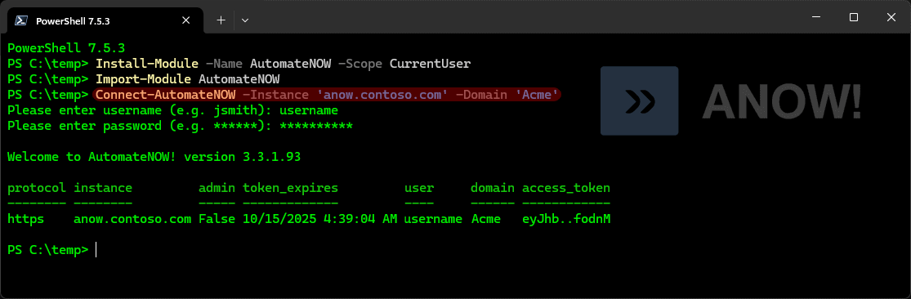

# AutomateNOW! PowerShell module

> Requires an account on an AutomateNOW! instance



```
Created by AutomateNOW-Fan
```
```
⚠ Not affiliated with InfiniteDATA
```
## Installation 🏗

Install from the PowerShell Gallery 👉 `Install-Module -Name AutomateNOW -Scope CurrentUser`
<br/><br/>
## Usage 🤔
Use `Connect-AutomateNOW` to establish your session (access token)
<br/><br/>
## Features 🤓

- Completely browserless operation
- Compatible with both Windows PowerShell 5.1 & PowerShell Core 7+
- Outputs can be PSCustomObject or (deserialized) JSON
- Supports both http & https protocols
- Each function will respond to -? with help information
- The session token may be continually updated via `Update-AutomateNOWToken`
- Manually substitute the encryption key bytes (if needed 🤞)
<br/><br/>
## Efficacy 🧪

This module has been tested against the below versions of AutomateNOW!

- 3.3.1.73
<br/><br/>
## Change Log 📝

### 1.0.7
- Added new functions: `Get-AutomateNOWTask`, `Show-AutomateNOWTaskType`, `Start-AutomateNOWTask`
- Added support for transparent colors in `New-AutomateNOWTag`
- Added a requirement to use `Disconnect-AutomateNOWTag` before connecting to a different instance
- Added the ability to include additional headers via -Headers with `Invoke-AutomateNOWAPI`
- Incorporated `ConvertTo-QueryString` (see MSIdentityTools on the PowerShell Gallery)
- Fixed an issue with the token expiration date sometimes showing +1 hour ahead
- Fixed an issue with HTTP error hints not being shown
- Fixed an issue with the domain not being set in the header variable whenever the domain was specified with the -Domain parameter of `Confirm-AutomateNOWSession`

### 1.0.6
- Added new functions: `Get-AutomateNOWWorkflow`, `Get-AutomateNOWFolder`, `New-AutomateNOWFolder`
- Added masked input to (and fixed some minor bugs with) `Connect-AutomateNOW`
- Improved guidance when http codes 401, 403 and 404 are encountered
- Fixed an issue with the usage of `Add-Type` (applies to Windows PowerShell only)
- Changed `Invoke-AutomateNOWAPI` will no longer recognize a GET request that accidentally included a body

### 1.0.5
- Fixed an issue with token updating

### 1.0.4
- Finished adding the help content with examples to each function

### 1.0.3
- Added new functions: `Import-AutomateNOWIcon`, `New-AutomateNOWTag`, `Remove-AutomateNOWTag` & `Update-AutomateNOWToken`
- Added the ability to refresh the token (See `Update-AutomateNOWToken`)
- Fixed an issue where the -SkipCertificateCheck parameter was included in PowerShell 7 even when it was not needed

### 1.0.2
- Cosmetic fixes for PowerShell Gallery (again!)

### 1.0.1
- Cosmetic fixes for PowerShell Gallery

### 1.0.0
- Initial release (feedback requested)
<br/><br/>
## Notes 📝

Use the -NotSecure parameter when connecting to an instance that doesn't use https 😒
<br/><br/>
## Functions 🛠

`Confirm-AutomateNOWSession`

`Connect-AutomateNOW`

`ConvertTo-QueryString`

`Disconnect-AutomateNOW`

`Get-AutomateNOWDomain`

`Get-AutomateNOWFolder`

`Get-AutomateNOWNode`

`Get-AutomateNOWTag`

`Get-AutomateNOWTask`

`Get-AutomateNOWTriggerLog`

`Get-AutomateNOWUser`

`Get-AutomateNOWWorkflow`

`Import-AutomateNOWIcon`

`Invoke-AutomateNOWAPI`

`New-AutomateNOWFolder`

`New-AutomateNOWTag`

`Remove-AutomateNOWTag`

`Set-AutomateNOWPassword`

`Show-AutomateNOWDomain`

`Show-AutomateNOWTaskType`

`Start-AutomateNOWTask`

`Switch-AutomateNOWDomain`

`Update-AutomateNOWToken`

